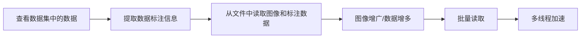

[TOC]

# 目标检测概述

目标检测要从图像中确定出现了哪些类别的物体，并标出每个物体的位置。

## 图像分类VS目标检测


- 图像分类任务只需识别出这是一张斑马的图片。
- 目标检测任务不仅要识别出这是一张斑马的图片，还要标出图中斑马的位置。

## 穷举法

假设我们现在有某种方式可以在输入图片上生成一系列可能包含物体的区域，这些区域称为候选区域，在一张图上可以生成很多个候选区域。然后对每个候选区域，可以把它单独当成一幅图像来看待，使用图像分类模型对它进行分类，看它属于哪个类别或者背景（即不包含任何物体的类别）。直观地，可以想到一种简单的穷举法。


A为图像上的某个像素点，B为A右下方另外一个像素点，A、B两点可以确定一个矩形框，记作AB。

- 如图3（a）所示：A在图片左上角位置，B遍历除A之外的所有位置，生成矩形框A1B1, …, A1Bn, …
- 如图3（b）所示：A在图片中间某个位置，B遍历A右下方所有位置，生成矩形框AkB1, …, AkBn, …

当A遍历图像上所有像素点，B则遍历它右下方所有的像素点，最终生成的矩形框集合{AiBj}将会包含图像上所有可以选择的区域。

只要我们对每个候选区域的分类足够的准确，则一定能找到跟实际物体足够接近的区域来。穷举法也许能得到正确的预测结果，但其计算量也是非常巨大的，其所生成的总候选区域数目约为
$$
\frac{W^2 H^2}{4}
$$
假设H=W=100，总数将会达到2.5×10^7个，如此多的候选区域使得这种方法几乎没有什么实用性。但是通过这种方式，我们可以看出，假设分类任务完成的足够完美，从理论上来讲检测任务也是可以解决的，亟待解决的问题是如何设计出合适的方法来产生候选区域（又称作感兴趣区域，Region of Interest，ROI）

## 目标检测算法流程

好的算法需要由合理的产生候选区域的方法。


检测算法的核心问题：

1. 如何产生候选区域，并对它进行标注
2. 如何提取图像特征，并将提取到的特征图与候选区域的类别和位置进行关联

## 检测算法发展历程


- 2013年，[Ross Girshick](https://arxiv.org/abs/1311.2524) 等人于首次将CNN的方法应用在目标检测任务上，他们使用传统图像算法[Selective Search](https://link.springer.com/article/10.1007/s11263-013-0620-5)产生候选区域，取得了极大的成功，这就是对目标检测领域影响深远的区域卷积神经网络(R-CNN)模型。
- 2015年，[Ross Girshick](https://arxiv.org/abs/1504.08083) 对此方法进行了改进，提出了Fast R-CNN模型。通过将不同区域的物体共用卷积层的计算，大大缩减了计算量，提高了处理速度，而且还引入了调整目标物体位置的回归方法，进一步提高了位置预测的准确性。
- 2015年，[Shaoqing Ren](https://arxiv.org/abs/1506.01497) 等人提出了Faster R-CNN模型，提出了RPN的方法来产生物体的候选区域，这一方法不再需要使用传统的图像处理算法来产生候选区域，进一步提升了处理速度。
- 2017年，[Kaiming He](https://arxiv.org/abs/1703.06870) 等人提出了Mask R-CNN模型，只需要在Faster R-CNN模型上添加比较少的计算量，就可以同时实现目标检测和物体实例分割两个任务。

以上都是基于R-CNN系列的著名模型，对目标检测方向的发展有着较大的影响力。此外，还有一些其他模型，比如[SSD](https://arxiv.org/abs/1512.02325)、YOLO([1](https://arxiv.org/abs/1506.02640v5), [2](https://arxiv.org/abs/1612.08242), [3](https://arxiv.org/abs/1804.02767))、[R-FCN](https://arxiv.org/abs/1605.06409)等也都是目标检测领域流行的模型结构。

- 两阶段算法：R-CNN的系列算法分成两个阶段，先在图像上产生候选区域，再对候选区域进行分类并预测目标物体位置。S
- 单阶段算法：SSD和YOLO算法则只使用一个网络同时产生候选区域并预测出物体的类别和位置，所以它们通常被叫做单阶段检测算法。

参考文献：


# 目标检测基础知识

## 边界框（Bounding Box）

**边界框**：正好能包含住物体的矩形框，英文：bounding box，简称bbox

**边界框的表示方法**：

- xyxy格式，[x1, y1, x2, y2]，左上角[x1, y1]，右下角[x2, y2]
- xywh格式，[x, y, w, h]，中心点[x, y]，宽度w，高度h

**真实框**：数据集标注中给出的目标物体对应的边界框，Ground Truth Box， 简称gt_box

**预测框**：由模型预测输出的可能包含目标物体的边界框Prediction Box，简称pred_box

**检测任务输出**：[L, P, x1, y1, x2, y2]，L是类别标签，P是所属类别的概率，一张图片会对应多个预测框

------

注意：

1. 在阅读代码时，请注意使用的是哪一种格式的表示方式。
2. 图片坐标的原点在左上角，x轴向右为正方向，y轴向下为正方向。

------

## 锚框

**锚框**：认为构造出来的假想框，以某种指定的规则生成

**生成方式**：指定宽度和高度，在图像上选一个中心点


**预测框**：在锚框的基础进行微调，由模型预测调整的幅度每个候选区域可以看做类似机器学习里面的一个样本，如果给它们打上标签，就可以建立模型了。

## 交并比

- 锚框和真实框的重合程度

Jaccard交并比（Intersection of Union，简称：IoU）衡量两个集合的重合程度。
$$
IoU =\frac{A \cap B}{A \cup B}
$$


### 计算IoU

如果有相交部分，则相交部分左上角坐标为：
$$
x_1 = max(x_{a1}, x_{b1}), y_1 = max(y_{a1}, y_{b1})
$$
相交部分右下角坐标为：
$$
x_2 = min(x_{a2}, x_{b2}), y_2 = max(y_{a2}, y_{b2})
$$

相交部分面积：
$$
intersection = max(x_2 - x_1 +1.0, 0)*max(y_2 - y_1 + 1.0, 0)
$$

矩形A和B的面积
$$
S_A = (x_{a2}-x_{a1} + 1.0)*(y_{a2}-y_{a1} + 1.0)
$$

$$
S_B = (x_{b2}-x_{b1} + 1.0)*(y_{b2}-y_{b1} + 1.0)
$$

相交部分面积
$$
union = S_A + S_B - intersection
$$
交并比
$$
IoU = \frac {intersection} {union}
$$

```python
# 计算IoU，矩形框的坐标形式为xyxy，这个函数会被保存在box_utils.py文件中
def box_iou_xyxy(box1, box2):
    # 获取box1左上角和右下角的坐标
    x1min, y1min, x1max, y1max = box1[0], box1[1], box1[2], box1[3]
    # 计算box1的面积
    s1 = (y1max - y1min + 1.) * (x1max - x1min + 1.)
    # 获取box2左上角和右下角的坐标
    x2min, y2min, x2max, y2max = box2[0], box2[1], box2[2], box2[3]
    # 计算box2的面积
    s2 = (y2max - y2min + 1.) * (x2max - x2min + 1.)
    
    # 计算相交矩形框的坐标
    xmin = np.maximum(x1min, x2min)
    ymin = np.maximum(y1min, y2min)
    xmax = np.minimum(x1max, x2max)
    ymax = np.minimum(y1max, y2max)
    # 计算相交矩形行的高度、宽度、面积
    inter_h = np.maximum(ymax - ymin + 1., 0.)
    inter_w = np.maximum(xmax - xmin + 1., 0.)
    intersection = inter_h * inter_w
    # 计算相并面积
    union = s1 + s2 - intersection
    # 计算交并比
    iou = intersection / union
    return iou


bbox1 = [100., 100., 200., 200.]
bbox2 = [120., 120., 220., 220.]
iou = box_iou_xyxy(bbox1, bbox2)
print('IoU is {}'.format(iou))  
IoU is 0.47402644317607107
```


# 林业病虫害数据集和数据预处理方法

本例使用百度与林业大学合作开发的林业病虫害防治项目中用到昆虫数据集。提供了2183张图片，其中训练集1693张，验证集245张，测试集245张。


## 读取数据集标注信息

- 提供了2183张图片，其中训练集1693张，验证集245，测试集245张。
- 包含7种昆虫，分别是Boerner、Leconte、Linnaeus、acuminatus、armandi、coleoptera和linnaeus。
- 包含了图片和标注，请读者先将数据解压，并存放在insects目录下。


数据目录结构：

```shell
insects
        |---train
        |         |---annotations
        |         |         |---xmls
        |         |                  |---100.xml
        |         |                  |---101.xml
        |         |                  |---...
        |         |
        |         |---images
        |                   |---100.jpeg
        |                   |---101.jpeg
        |                   |---...
        |
        |---val
        |        |---annotations
        |        |         |---xmls
        |        |                  |---1221.xml
        |        |                  |---1277.xml
        |        |                  |---...
        |        |
        |        |---images
        |                  |---1221.jpeg
        |                  |---1277.jpeg
        |                  |---...
        |
        |---test
                 |---images
                           |---1833.jpeg
                           |---1838.jpeg
                           |---...
```

insects包含train、val和test三个文件夹。train/annotations/xmls目录下存放着图片的标注。每个xml文件是对一张图片的说明，包括图片尺寸、包含的昆虫名称、在图片上出现的位置等信息。

```xml
<annotation>
        <folder>刘霏霏</folder>
        <filename>100.jpeg</filename>
        <path>/home/fion/桌面/刘霏霏/100.jpeg</path>
        <source>
                <database>Unknown</database>
        </source>
        <size>
                <width>1336</width>
                <height>1336</height>
                <depth>3</depth>
        </size>
        <segmented>0</segmented>
        <object>
                <name>Boerner</name>
                <pose>Unspecified</pose>
                <truncated>0</truncated>
                <difficult>0</difficult>
                <bndbox>
                        <xmin>500</xmin>
                        <ymin>893</ymin>
                        <xmax>656</xmax>
                        <ymax>966</ymax>
                </bndbox>
        </object>
        <object>
                <name>Leconte</name>
                <pose>Unspecified</pose>
                <truncated>0</truncated>
                <difficult>0</difficult>
                <bndbox>
                        <xmin>622</xmin>
                        <ymin>490</ymin>
                        <xmax>756</xmax>
                        <ymax>610</ymax>
                </bndbox>
        </object>
        <object>
                <name>armandi</name>
                <pose>Unspecified</pose>
                <truncated>0</truncated>
                <difficult>0</difficult>
                <bndbox>
                        <xmin>432</xmin>
                        <ymin>663</ymin>
                        <xmax>517</xmax>
                        <ymax>729</ymax>
                </bndbox>
        </object>
        <object>
                <name>coleoptera</name>
                <pose>Unspecified</pose>
                <truncated>0</truncated>
                <difficult>0</difficult>
                <bndbox>
                        <xmin>624</xmin>
                        <ymin>685</ymin>
                        <xmax>697</xmax>
                        <ymax>771</ymax>
                </bndbox>
        </object>
        <object>
                <name>linnaeus</name>
                <pose>Unspecified</pose>
                <truncated>0</truncated>
                <difficult>0</difficult>
                <bndbox>
                        <xmin>783</xmin>
                        <ymin>700</ymin>
                        <xmax>856</xmax>
                        <ymax>802</ymax>
                </bndbox>
        </object>
</annotation>
```

xml文件中的主要参数说明如下：

size：图片尺寸

object：图片中包含的物体，一张图片可能中包含多个物体

- name：昆虫名称
- bndbox：物体真实框
- difficult：识别是否困难

首先将昆虫的类别名字（字符串）转化成数字表示的类别。昆虫类别名称的列表是：['Boerner', 'Leconte', 'Linnaeus', 'acuminatus', 'armandi', 'coleoptera', 'linnaeus']，记此列表中：'Boerner'对应类别0，'Leconte'对应类别1，...，'linnaeus'对应类别6。

### 将昆虫名字转化为数字标签

```python
INSECT_NAMES = ['Boerner', 'Leconte', 'Linnaeus', 
                'acuminatus', 'armandi', 'coleoptera', 'linnaeus']

def get_insect_names():
    """
    return a dict, as following,
        {'Boerner': 0,
         'Leconte': 1,
         'Linnaeus': 2, 
         'acuminatus': 3,
         'armandi': 4,
         'coleoptera': 5,
         'linnaeus': 6
        }
    It can map the insect name into an integer label.
    """
    insect_category2id = {}
    for i, item in enumerate(INSECT_NAMES):
        insect_category2id[item] = i

    return insect_category2id
```

### 读取annotations目录下的xml文件

```python
import os
import numpy as np
import xml.etree.ElementTree as ET  							#读取xml文件的包

def get_annotations(cname2cid, datadir):
    filenames = os.listdir(os.path.join(datadir, 'annotations', 'xmls'))
    records = []
    ct = 0
    for fname in filenames:
        fid = fname.split('.')[0]
        fpath = os.path.join(datadir, 'annotations', 'xmls', fname)
        img_file = os.path.join(datadir, 'images', fid + '.jpeg')
        tree = ET.parse(fpath)									# 读取xml文件的内容

        if tree.find('id') is None:
            im_id = np.array([ct])
        else:
            im_id = np.array([int(tree.find('id').text)])

        objs = tree.findall('object') 							# 找到所有的object
        im_w = float(tree.find('size').find('width').text)		# size中找到图像的长和宽
        im_h = float(tree.find('size').find('height').text)
        gt_bbox = np.zeros((len(objs), 4), dtype=np.float32)	# 用于存储真实框信息
        gt_class = np.zeros((len(objs), ), dtype=np.int32)		# 用于存储每个object的类别
        is_crowd = np.zeros((len(objs), ), dtype=np.int32)		# objects是否拥挤，暂时不用
        difficult = np.zeros((len(objs), ), dtype=np.int32)		# 暂时不用
        for i, obj in enumerate(objs):							# 对图片中的每个目标进行操作
            cname = obj.find('name').text						# 获取object名并转为数字类别
            gt_class[i] = cname2cid[cname]
            _difficult = int(obj.find('difficult').text)		# 获取真实框的坐标
            x1 = float(obj.find('bndbox').find('xmin').text)
            y1 = float(obj.find('bndbox').find('ymin').text)
            x2 = float(obj.find('bndbox').find('xmax').text)
            y2 = float(obj.find('bndbox').find('ymax').text)
            x1 = max(0, x1)										# 真实框坐标不能超出图片范围
            y1 = max(0, y1)
            x2 = min(im_w - 1, x2)
            y2 = min(im_h - 1, y2)
            # 这里使用xywh格式来表示目标物体真实框
            gt_bbox[i] = [(x1+x2)/2.0 , (y1+y2)/2.0, x2-x1+1., y2-y1+1.]	#转为xywh格式
            is_crowd[i] = 0
            difficult[i] = _difficult

        voc_rec = {
            'im_file': img_file,		# 图片存放路径
            'im_id': im_id,				# 图片编号
            'h': im_h,					# 图片尺寸
            'w': im_w,
            'is_crowd': is_crowd,
            'gt_class': gt_class,		# 真实框包含物体的类别
            'gt_bbox': gt_bbox,			# 真实框的坐标
            'gt_poly': [],
            'difficult': difficult
            }
        if len(objs) != 0:
            records.append(voc_rec)
        ct += 1
    return records
```

```python
TRAINDIR = '/home/aistudio/work/insects/train'
TESTDIR = '/home/aistudio/work/insects/test'
VALIDDIR = '/home/aistudio/work/insects/val'
cname2cid = get_insect_names()
records = get_annotations(cname2cid, TRAINDIR)
```

```python
records[0]
{'im_file': '/home/aistudio/work/insects/train/images/1877.jpeg',
 'im_id': array([0]),
 'h': 1244.0,
 'w': 1244.0,
 'is_crowd': array([0, 0, 0, 0, 0, 0, 0, 0], dtype=int32),
 'gt_class': array([1, 1, 0, 2, 3, 4, 5, 5], dtype=int32),
 'gt_bbox': array([[934.5, 594. , 196. , 171. ],
        [593.5, 500.5, 150. , 110. ],
        [748.5, 814. ,  76. , 147. ],
        [471.5, 633. ,  90. ,  83. ],
        [545. , 831.5,  89. ,  60. ],
        [764. , 500.5,  85. , 106. ],
        [623.5, 688. ,  76. ,  59. ],
        [614.5, 859.5,  42. ,  56. ]], dtype=float32),
 'gt_poly': [],
 'difficult': array([0, 0, 0, 0, 0, 0, 0, 0], dtype=int32)}
```

## 读取数据和预处理

### 数据读取

```python
### 数据读取
import cv2

def get_bbox(gt_bbox, gt_class):
    '''
    对于一般的检测任务来说，一张图片上往往会有多个目标物体
    设置参数MAX_NUM = 50， 即一张图片最多取50个真实框；
    如果真实框的数目少于50个，则将不足部分的
    gt_bbox, gt_class和gt_score的各项数值全设置为0
    '''
    MAX_NUM = 50
    gt_bbox2 = np.zeros((MAX_NUM, 4))
    gt_class2 = np.zeros((MAX_NUM,))
    for i in range(len(gt_bbox)):
        gt_bbox2[i, :] = gt_bbox[i, :]
        gt_class2[i] = gt_class[i]
        if i >= MAX_NUM:
            break
    return gt_bbox2, gt_class2

def get_img_data_from_file(record):			# 根据record中保存的图片信息读取图片文件和标注
    """
    record is a dict as following,
      record = {
            'im_file': img_file,
            'im_id': im_id,
            'h': im_h,
            'w': im_w,
            'is_crowd': is_crowd,
            'gt_class': gt_class,
            'gt_bbox': gt_bbox,
            'gt_poly': [],
            'difficult': difficult
            }
    """
    im_file = record['im_file']
    h = record['h']
    w = record['w']
    is_crowd = record['is_crowd']
    gt_class = record['gt_class']			# 读取真实框
    gt_bbox = record['gt_bbox']				# 读取类别
    difficult = record['difficult']

    img = cv2.imread(im_file)				# 从文件读取图片
    img = cv2.cvtColor(img, cv2.COLOR_BGR2RGB)

    # check if h and w in record equals that read from img
    assert img.shape[0] == int(h), \
             "image height of {} inconsistent in record({}) and img file({})".format(
               im_file, h, img.shape[0])

    assert img.shape[1] == int(w), \
             "image width of {} inconsistent in record({}) and img file({})".format(
               im_file, w, img.shape[1])

    gt_boxes, gt_labels = get_bbox(gt_bbox, gt_class)		# 统一格式

    # gt_bbox 用相对值
    # 对原图像进行了缩放，那么用相对值就无需再处理了，否则可能需要随着尺寸变化而雪妖改写
    gt_boxes[:, 0] = gt_boxes[:, 0] / float(w)
    gt_boxes[:, 1] = gt_boxes[:, 1] / float(h)
    gt_boxes[:, 2] = gt_boxes[:, 2] / float(w)
    gt_boxes[:, 3] = gt_boxes[:, 3] / float(h)
    
    # 图像数据img，真实框坐标gt_boxes，真实框包含的物体类别gt_labels，图像尺寸scales。
    return img, gt_boxes, gt_labels, (h, w)
```

### 数据预处理——图像增广

在计算机视觉中，通常会对图像做一些随机的变化，产生**相似但又不完全相同**的样本。**主要作用**是扩大训练数据集，抑制过拟合，提升模型的泛化能力，常用的方法有：

- 随机改变亮暗、对比度和颜色等
- 随机填充
- 随机裁剪
- 随机缩放
- 随机翻转

#### 随机改变亮暗、对比度和颜色

```python
import numpy as np
import cv2
from PIL import Image, ImageEnhance
import random

# 随机改变亮暗、对比度和颜色等
def random_distort(img):
    # 随机改变亮度
    def random_brightness(img, lower=0.5, upper=1.5):
        e = np.random.uniform(lower, upper)
        return ImageEnhance.Brightness(img).enhance(e)  		  # 亮度
    # 随机改变对比度
    def random_contrast(img, lower=0.5, upper=1.5):
        e = np.random.uniform(lower, upper)
        return ImageEnhance.Contrast(img).enhance(e)  		 	  # 对比度
    # 随机改变颜色
    def random_color(img, lower=0.5, upper=1.5):
        e = np.random.uniform(lower, upper)
        return ImageEnhance.Color(img).enhance(e)				  # 颜色

    ops = [random_brightness, random_contrast, random_color]	  # 随机打乱三种操作
    np.random.shuffle(ops)

    img = Image.fromarray(img)
    img = ops[0](img)
    img = ops[1](img)
    img = ops[2](img)
    img = np.asarray(img)

    return img
```

#### 随机填充

```python
# 随机填充
def random_expand(img,
                  gtboxes,
                  max_ratio=4.,
                  fill=None,
                  keep_ratio=True,
                  thresh=0.5):
    if random.random() > thresh:
        return img, gtboxes

    if max_ratio < 1.0:
        return img, gtboxes

    h, w, c = img.shape
    ratio_x = random.uniform(1, max_ratio)
    if keep_ratio:
        ratio_y = ratio_x
    else:
        ratio_y = random.uniform(1, max_ratio)
    oh = int(h * ratio_y)
    ow = int(w * ratio_x)
    off_x = random.randint(0, ow - w)
    off_y = random.randint(0, oh - h)
	

    # 产生大小为(oh, ow)的新图片，先将其数值全部填充为fill指定的数值
    out_img = np.zeros((oh, ow, c))
    if fill and len(fill) == c:
        for i in range(c):
            out_img[:, :, i] = fill[i] * 255.0
	
    # 将原图赋值到新图片对应区域
    out_img[off_y:off_y + h, off_x:off_x + w, :] = img
    # 计算在新图片上真实框的坐标
    gtboxes[:, 0] = ((gtboxes[:, 0] * w) + off_x) / float(ow)
    gtboxes[:, 1] = ((gtboxes[:, 1] * h) + off_y) / float(oh)
    gtboxes[:, 2] = gtboxes[:, 2] / ratio_x
    gtboxes[:, 3] = gtboxes[:, 3] / ratio_y

    return out_img.astype('uint8'), gtboxes
```

#### 随机裁剪

随机裁剪之前需要先定义两个函数，`multi_box_iou_xywh`和`box_crop`这两个函数将被保存在box_utils.py文件中。

```python
import numpy as np

def multi_box_iou_xywh(box1, box2):
    """
    In this case, box1 or box2 can contain multi boxes.
    Only two cases can be processed in this method:
       1, box1 and box2 have the same shape, box1.shape == box2.shape
       2, either box1 or box2 contains only one box, len(box1) == 1 or len(box2) == 1
    If the shape of box1 and box2 does not match, and both of them contain multi boxes, it will be wrong.
    """
    assert box1.shape[-1] == 4, "Box1 shape[-1] should be 4."
    assert box2.shape[-1] == 4, "Box2 shape[-1] should be 4."


    b1_x1, b1_x2 = box1[:, 0] - box1[:, 2] / 2, box1[:, 0] + box1[:, 2] / 2
    b1_y1, b1_y2 = box1[:, 1] - box1[:, 3] / 2, box1[:, 1] + box1[:, 3] / 2
    b2_x1, b2_x2 = box2[:, 0] - box2[:, 2] / 2, box2[:, 0] + box2[:, 2] / 2
    b2_y1, b2_y2 = box2[:, 1] - box2[:, 3] / 2, box2[:, 1] + box2[:, 3] / 2

    inter_x1 = np.maximum(b1_x1, b2_x1)
    inter_x2 = np.minimum(b1_x2, b2_x2)
    inter_y1 = np.maximum(b1_y1, b2_y1)
    inter_y2 = np.minimum(b1_y2, b2_y2)
    inter_w = inter_x2 - inter_x1
    inter_h = inter_y2 - inter_y1
    inter_w = np.clip(inter_w, a_min=0., a_max=None)
    inter_h = np.clip(inter_h, a_min=0., a_max=None)

    inter_area = inter_w * inter_h
    b1_area = (b1_x2 - b1_x1) * (b1_y2 - b1_y1)
    b2_area = (b2_x2 - b2_x1) * (b2_y2 - b2_y1)

    return inter_area / (b1_area + b2_area - inter_area)

def box_crop(boxes, labels, crop, img_shape):
    x, y, w, h = map(float, crop)
    im_w, im_h = map(float, img_shape)

    boxes = boxes.copy()
    boxes[:, 0], boxes[:, 2] = (boxes[:, 0] - boxes[:, 2] / 2) * im_w, (
        boxes[:, 0] + boxes[:, 2] / 2) * im_w
    boxes[:, 1], boxes[:, 3] = (boxes[:, 1] - boxes[:, 3] / 2) * im_h, (
        boxes[:, 1] + boxes[:, 3] / 2) * im_h

    crop_box = np.array([x, y, x + w, y + h])
    centers = (boxes[:, :2] + boxes[:, 2:]) / 2.0
    mask = np.logical_and(crop_box[:2] <= centers, centers <= crop_box[2:]).all(
        axis=1)

    boxes[:, :2] = np.maximum(boxes[:, :2], crop_box[:2])
    boxes[:, 2:] = np.minimum(boxes[:, 2:], crop_box[2:])
    boxes[:, :2] -= crop_box[:2]
    boxes[:, 2:] -= crop_box[:2]

    mask = np.logical_and(mask, (boxes[:, :2] < boxes[:, 2:]).all(axis=1))
    boxes = boxes * np.expand_dims(mask.astype('float32'), axis=1)
    labels = labels * mask.astype('float32')
    boxes[:, 0], boxes[:, 2] = (boxes[:, 0] + boxes[:, 2]) / 2 / w, (
        boxes[:, 2] - boxes[:, 0]) / w
    boxes[:, 1], boxes[:, 3] = (boxes[:, 1] + boxes[:, 3]) / 2 / h, (
        boxes[:, 3] - boxes[:, 1]) / h

    return boxes, labels, mask.sum()
```

```python
# 随机裁剪
def random_crop(img,
                boxes,
                labels,
                scales=[0.3, 1.0],
                max_ratio=2.0,
                constraints=None,
                max_trial=50):
    if len(boxes) == 0:
        return img, boxes

    if not constraints:
        constraints = [(0.1, 1.0), (0.3, 1.0), (0.5, 1.0), (0.7, 1.0),
                       (0.9, 1.0), (0.0, 1.0)]

    img = Image.fromarray(img)
    w, h = img.size
    crops = [(0, 0, w, h)]
    for min_iou, max_iou in constraints:
        for _ in range(max_trial):
            scale = random.uniform(scales[0], scales[1])
            aspect_ratio = random.uniform(max(1 / max_ratio, scale * scale), \
                                          min(max_ratio, 1 / scale / scale))
            crop_h = int(h * scale / np.sqrt(aspect_ratio))
            crop_w = int(w * scale * np.sqrt(aspect_ratio))
            crop_x = random.randrange(w - crop_w)
            crop_y = random.randrange(h - crop_h)
            crop_box = np.array([[(crop_x + crop_w / 2.0) / w,
                                  (crop_y + crop_h / 2.0) / h,
                                  crop_w / float(w), crop_h / float(h)]])

            iou = multi_box_iou_xywh(crop_box, boxes)			#计算多个框之间的IoU
            if min_iou <= iou.min() and max_iou >= iou.max():
                crops.append((crop_x, crop_y, crop_w, crop_h))
                break

    while crops:
        crop = crops.pop(np.random.randint(0, len(crops)))
        # 计算裁剪之后的真实框，如果裁的太偏了，则重新裁一次，直到裁剪出合适的新图片
        crop_boxes, crop_labels, box_num = box_crop(boxes, labels, crop, (w, h))
        if box_num < 1:
            continue
        img = img.crop((crop[0], crop[1], crop[0] + crop[2],
                        crop[1] + crop[3])).resize(img.size, Image.LANCZOS)
        img = np.asarray(img)
        return img, crop_boxes, crop_labels
    img = np.asarray(img)
    return img, boxes, labels
```

#### 随机缩放

```python
# 随机缩放
def random_interp(img, size, interp=None):  # size是随机生成的尺寸
    interp_method = [
        cv2.INTER_NEAREST,
        cv2.INTER_LINEAR,
        cv2.INTER_AREA,
        cv2.INTER_CUBIC,
        cv2.INTER_LANCZOS4,
    ]
    # 随机缩放的插值方法
    if not interp or interp not in interp_method: 
        interp = interp_method[random.randint(0, len(interp_method) - 1)]
    h, w, _ = img.shape
    im_scale_x = size / float(w)
    im_scale_y = size / float(h)
    # 调整图像大小
    img = cv2.resize(
        img, None, None, fx=im_scale_x, fy=im_scale_y, interpolation=interp)
    return img
```

#### 随机翻转

```python
# 随机翻转
def random_flip(img, gtboxes, thresh=0.5):
    if random.random() > thresh:
        img = img[:, ::-1, :]
        gtboxes[:, 0] = 1.0 - gtboxes[:, 0]
    return img, gtboxes
```

#### 随机打乱真实框顺序

```python
# 随机打乱真实框排列顺序
def shuffle_gtbox(gtbox, gtlabel):
    gt = np.concatenate(
        [gtbox, gtlabel[:, np.newaxis]], axis=1)
    idx = np.arange(gt.shape[0])
    np.random.shuffle(idx)
    gt = gt[idx, :]
    return gt[:, :4], gt[:, 4]
```

#### 图像增广方法汇总

```python
# 图像增广方法汇总
def image_augment(img, gtboxes, gtlabels, size, means=None):
    # 随机改变亮暗、对比度和颜色等
    img = random_distort(img)
    # 随机填充
    img, gtboxes = random_expand(img, gtboxes, fill=means)
    # 随机裁剪
    img, gtboxes, gtlabels, = random_crop(img, gtboxes, gtlabels)
    # 随机缩放
    img = random_interp(img, size)
    # 随机翻转
    img, gtboxes = random_flip(img, gtboxes)
    # 随机打乱真实框排列顺序
    gtboxes, gtlabels = shuffle_gtbox(gtboxes, gtlabels)

    return img.astype('float32'), gtboxes.astype('float32'), gtlabels.astype('int32')
```

#### 读取数据并做标准化处理

```python
def get_img_data(record, size=640):
    # 从文件中读入图像和标注信息
    img, gt_boxes, gt_labels, scales = get_img_data_from_file(record)
    # 图像增广
    img, gt_boxes, gt_labels = image_augment(img, gt_boxes, gt_labels, size)
    # 对像素进行均值-方差标准化，使用的是在COCO数据集上的统计结果
    mean = [0.485, 0.456, 0.406]
    std = [0.229, 0.224, 0.225]
    mean = np.array(mean).reshape((1, 1, -1))
    std = np.array(std).reshape((1, 1, -1))
    # 像素标准化
    img = (img / 255.0 - mean) / std
    # 将数据维度从[H, W, C]转换为[C, H, W]
    img = img.astype('float32').transpose((2, 0, 1))
    return img, gt_boxes, gt_labels, scales
```


### 批量数据读取与多线程加速

#### 批量数据读取

```python
# 获取一个批次内样本随机缩放的尺寸
def get_img_size(mode):
    # 训练时随机产生尺寸，测试时固定尺寸608
    if (mode == 'train') or (mode == 'valid'):
        inds = np.array([0,1,2,3,4,5,6,7,8,9])
        ii = np.random.choice(inds)
        img_size = 320 + ii * 32
    else:
        img_size = 608
    return img_size

# 将 list形式的batch数据 转化成多个array构成的tuple
def make_array(batch_data):
    img_array = np.array([item[0] for item in batch_data], dtype = 'float32')
    gt_box_array = np.array([item[1] for item in batch_data], dtype = 'float32')
    gt_labels_array = np.array([item[2] for item in batch_data], dtype = 'int32')
    img_scale = np.array([item[3] for item in batch_data], dtype='int32')
    return img_array, gt_box_array, gt_labels_array, img_scale

# 批量读取数据，同一批次内图像的尺寸大小必须是一样的，
# 不同批次之间的大小是随机的，
# 由上面定义的get_img_size函数产生
def data_loader(datadir, batch_size= 10, mode='train'):
    cname2cid = get_insect_names()
    records = get_annotations(cname2cid, datadir)

    def reader():
        if mode == 'train':
            np.random.shuffle(records)
        batch_data = []
        img_size = get_img_size(mode)		# 获取图像尺寸，同一批次内的尺寸相同
        for record in records:
            #print(record)
            img, gt_bbox, gt_labels, im_shape = get_img_data(record, 
                                                             size=img_size)
            batch_data.append((img, gt_bbox, gt_labels, im_shape))
            if len(batch_data) == batch_size:
                # 调整mini-batch内的数据格式，将list形式的batch数据转换为np.array()
                yield make_array(batch_data)
                batch_data = []
                img_size = get_img_size(mode)
        if len(batch_data) > 0:
            yield make_array(batch_data)

    return reader
```

由于数据预处理耗时较长，可能会成为网络训练速度的瓶颈，所以需要对预处理部分进行优化。通过使用飞桨提供的API [paddle.reader.xmap_readers](https://www.paddlepaddle.org.cn/documentation/docs/zh/api_cn/io_cn/xmap_readers_cn.html#xmap-readers)可以开启多线程读取数据，具体实现代码如下。

#### 多线程加速

```python
import functools
import paddle

# 使用paddle.reader.xmap_readers实现多线程读取数据
def multithread_loader(datadir, batch_size= 10, mode='train'):
    cname2cid = get_insect_names()
    records = get_annotations(cname2cid, datadir)
    def reader():
        if mode == 'train':
            np.random.shuffle(records)
        img_size = get_img_size(mode)
        batch_data = []
        for record in records:
            batch_data.append((record, img_size))			# 保存record和图像尺寸
            if len(batch_data) == batch_size:
                yield batch_data
                batch_data = []
                img_size = get_img_size(mode)
        if len(batch_data) > 0:
            yield batch_data

    def get_data(samples):
        batch_data = []
        for sample in samples:
            record = sample[0]								# record
            img_size = sample[1]							# 图像尺寸
            img, gt_bbox, gt_labels, im_shape = get_img_data(record, size=img_size)
            batch_data.append((img, gt_bbox, gt_labels, im_shape))
        return make_array(batch_data)
	
    # 将reader中每次迭代的输出作为参数
    mapper = functools.partial(get_data, )
	# 开启线程数目8，缓存数据的条数10
    return paddle.reader.xmap_readers(mapper, reader, 8, 10)
```

数据预处理流程总结



### 测试数据的读取

- 不需要做图像增广，可以简化读取过程
- 不需要使用多线程
- 没有真实框信息，返回名城、图像数据、尺寸

```python
# 测试数据读取

# 将 list形式的batch数据 转化成多个array构成的tuple
def make_test_array(batch_data):
    img_name_array = np.array([item[0] for item in batch_data])
    img_data_array = np.array([item[1] for item in batch_data], dtype = 'float32')
    img_scale_array = np.array([item[2] for item in batch_data], dtype='int32')
    return img_name_array, img_data_array, img_scale_array

# 测试数据读取
def test_data_loader(datadir, batch_size= 10, test_image_size=608, mode='test'):
    """
    加载测试用的图片，测试数据没有groundtruth标签
    """
    image_names = os.listdir(datadir)
    def reader():
        batch_data = []
        img_size = test_image_size
        for image_name in image_names:
            file_path = os.path.join(datadir, image_name)
            img = cv2.imread(file_path)
            img = cv2.cvtColor(img, cv2.COLOR_BGR2RGB)
            H = img.shape[0]
            W = img.shape[1]
            img = cv2.resize(img, (img_size, img_size))

            mean = [0.485, 0.456, 0.406]
            std = [0.229, 0.224, 0.225]
            mean = np.array(mean).reshape((1, 1, -1))
            std = np.array(std).reshape((1, 1, -1))
            out_img = (img / 255.0 - mean) / std
            out_img = out_img.astype('float32').transpose((2, 0, 1))
            img = out_img #np.transpose(out_img, (2,0,1))
            im_shape = [H, W]

            batch_data.append((image_name.split('.')[0], img, im_shape))
            if len(batch_data) == batch_size:
                yield make_test_array(batch_data)
                batch_data = []
        if len(batch_data) > 0:
            yield make_test_array(batch_data)

    return reader
```

# 单阶段目标检测模型YOLO-V3

##  YOLO-V3模型的设计思想

YOLO-V3算法的基本思想可以分成两部分：

- 按一定规则在图片上产生一系列的候选区域，然后根据这些候选区域与图片上物体真实框之间的位置关系对候选区域进行标注。跟真实框足够接近的那些候选区域会被标注为正样本，同时将真实框的位置作为正样本的位置目标。偏离真实框较大的那些候选区域则会被标注为负样本，负样本不需要预测位置或者类别。
- 使用卷积神经网络提取图片特征并对候选区域的位置和类别进行预测。这样每个预测框就可以看成是一个样本，根据真实框相对它的位置和类别进行了标注而获得标签值，通过网络模型预测其位置和类别，将网络预测值和标签值进行比较，就可以建立起损失函数。


- 上半部分所示的过程是使用卷积神经网络对图片提取特征，随着网络不断向前传播，特征图的尺寸越来越小，每个像素点会代表更加抽象的特征模式，直到输出特征图，其尺寸减小为原图的1/32。
- 下半部分描述了生成候选区域的过程，首先将原图划分成多个小方块，每个小方块的大小是32×32，然后以每个小方块为中心分别生成一系列锚框，整张图片都会被锚框覆盖到。在每个锚框的基础上产生一个与之对应的预测框，根据锚框和预测框与图片上物体真实框之间的位置关系，对这些预测框进行标注。
- 将上方支路中输出的特征图与下方支路中产生的预测框标签建立关联，创建损失函数，开启端到端的训练过程。

主要特点：

- 单阶段检测，同时完成候选区域生成+物体位置和类别的预测
- 每个真实框只对应一个正的候选区域


## 产生候选区域

### 生成锚框

- Step1：将原图划分成多个小方块区域


将原始图片划分成m×n个区域，原始图片高度H=640, 宽度W=480，如果我们选择小块区域的尺寸为32×32，则m和n分别为：
$$
m = \frac {640} {32} = 20
$$

$$
n = \frac {480} {32} = 15
$$

- Step2：以小方块区域为中心，生成一系列锚框
  - 生成锚框的规则：
    - 中心点：小方块的区域中心
    - 大小：3种[w, h]分别：[116, 90], [156, 198], [373, 326]。原作者是在COCO数据集上进行的，此处的数据是作者在该数据上进行聚类，选取9个聚类中心，分析产生了3个具有典型代表的尺度。


在每个小方块区域都生成上述三种形状的锚框，将会覆盖整张图片，一张图片上锚框的总数为：20×15×3=900

### 生成预测框

所有锚框覆盖住了整张图片，但是锚框的位置是固定的，一般不会跟物体真实框刚好重合。要想得到跟物体真实框足够接近的预测结果，需要在锚框的基础上做一些小的调整。

`预测框`：可以看作是`在锚框的基础上做微调`，可以调整`中心坐标和宽度、高度`

YOLO-V3模型通过如下的公示实现在锚框的基础上微调产生预测框的中心坐标[bx, by]和宽、高[bw, bh]


其中，[cx, cy]是小方块区域左上角的坐标，[pw, ph]是锚框的宽度和高度，sigmoid保证了b的范围在[c,c+1]，即其会在小方块的内部。

说明：[cx, cy]是用小方块区域的大小作为单位尺寸计算出来的，上面（a）图中小方块区域对应的[cx, cy]是[4, 10]


### 标注候选区域

#### objectness


#### location


#### classification


#### 标注锚框的代码实现

```python
# 标注预测框的objectness
def get_objectness_label(img, gt_boxes, gt_labels, iou_threshold = 0.7,
                         anchors = [116, 90, 156, 198, 373, 326],
                         num_classes=7, downsample=32):
    """
    img 是输入的图像数据，形状是[N, C, H, W]
    gt_boxes，真实框，维度是[N, 50, 4]，其中50是真实框数目的上限，当图片中真实框不足50个时，不足部分的坐标全为0
              真实框坐标格式是xywh，这里使用相对值
    gt_labels，真实框所属类别，维度是[N, 50]
    iou_threshold，当预测框与真实框的iou大于iou_threshold时不将其看作是负样本
    anchors，锚框可选的尺寸
    anchor_masks，通过与anchors一起确定本层级的特征图应该选用多大尺寸的锚框
    num_classes，类别数目
    downsample，特征图相对于输入网络的图片尺寸变化的比例
    """

    img_shape = img.shape
    batchsize = img_shape[0]
    num_anchors = len(anchors) // 2
    input_h = img_shape[2]
    input_w = img_shape[3]
    # 将输入图片划分成num_rows x num_cols个小方块区域，每个小方块的边长是 downsample
    # 计算一共有多少行小方块
    num_rows = input_h // downsample
    # 计算一共有多少列小方块
    num_cols = input_w // downsample
	
    # 每张图片上有m×n个方块区域，每个区域有K个锚框，数据集中物体类别数目为N
    # [N, K, m, n]
    label_objectness = np.zeros([batchsize, num_anchors, num_rows, num_cols])
    # [N, K, C, m, n]
    label_classification = np.zeros([batchsize, num_anchors, num_classes, num_rows, num_cols])
    # [N, K, 4, m, n]
    label_location = np.zeros([batchsize, num_anchors, 4, num_rows, num_cols])
	# 位置损失函数的加权因子，调整不同大小物体的权重
    scale_location = np.ones([batchsize, num_anchors, num_rows, num_cols])

    # 对batchsize进行循环，依次处理每张图片
    for n in range(batchsize): 								# 对所有图片做循环
        # 对图片上的真实框进行循环，依次找出跟真实框形状最匹配的锚框
        for n_gt in range(len(gt_boxes[n])):				# 对所有真实框做循环
            gt = gt_boxes[n][n_gt]
            gt_cls = gt_labels[n][n_gt]
            gt_center_x = gt[0]
            gt_center_y = gt[1]
            gt_width = gt[2]
            gt_height = gt[3]
            # 真实框最大个数设置为50，有一部分是无效的，直接跳过无效的真实框
            if (gt_height < 1e-3) or (gt_height < 1e-3):
                continue
            # 找出真实框中心所在的位置
            i = int(gt_center_y * num_rows)
            j = int(gt_center_x * num_cols)
            ious = []
            # 对第i行第j列小方块区域内的所有锚框做循环
            for ka in range(num_anchors):
                # 计算IoU时只考虑锚框和真实的形状，不考虑中心位置。目的是找出与真实框形状最匹配的锚框
                bbox1 = [0., 0., float(gt_width), float(gt_height)]
                anchor_w = anchors[ka * 2]
                anchor_h = anchors[ka * 2 + 1]
                bbox2 = [0., 0., anchor_w/float(input_w), anchor_h/float(input_h)]
                # 计算iou
                iou = box_iou_xywh(bbox1, bbox2)
                ious.append(iou)
            # 选出与真实框IoU最大的锚框
            ious = np.array(ious)
            inds = np.argsort(ious)
            k = inds[-1]
            
            # 将IoU最大的锚框objectness设置为1，类别设置为对应的真实框类别
            label_objectness[n, k, i, j] = 1
            c = gt_cls
            label_classification[n, k, c, i, j] = 1.

            # for those prediction bbox with objectness =1, set label of location
            # 计算位置标签
            dx_label = gt_center_x * num_cols - j
            dy_label = gt_center_y * num_rows - i
            dw_label = np.log(gt_width * input_w / anchors[k*2])
            dh_label = np.log(gt_height * input_h / anchors[k*2 + 1])
            
            # 设置objectness为1的锚框的位置标签
            label_location[n, k, 0, i, j] = dx_label
            label_location[n, k, 1, i, j] = dy_label
            label_location[n, k, 2, i, j] = dw_label
            label_location[n, k, 3, i, j] = dh_label
            # scale_location用来调节不同尺寸的锚框对损失函数的贡献，作为加权系数和位置损失函数相乘
            # 较小的物体有更大的权重
            scale_location[n, k, i, j] = 2.0 - gt_width * gt_height

    # 目前根据每张图片上所有出现过的gt box，都标注出了objectness为正的预测框，剩下的预测框则默认objectness为0
    # 对于objectness为1的预测框，标出了他们所包含的物体类别，以及位置回归的目标
    return label_objectness.astype('float32'), label_location.astype('float32'), label_classification.astype('float32'), \
             scale_location.astype('float32')
```

## 卷积神经网络提取特征

YOLO-V3算法使用的骨干网络是Darknet53。其在ImageNet图像分类任务上取得了很好的成绩。在检测任务中，将图中C0后面的平均池化、全连接层和Softmax去掉，保留从输入到C0部分的网络结构，作为检测模型的基础网络结构，也称为骨干网络。YOLO-V3模型会在骨干网络的基础上，再添加检测相关的网络模块。


```python
import paddle.fluid as fluid
from paddle.fluid.param_attr import ParamAttr
from paddle.fluid.regularizer import L2Decay

from paddle.fluid.dygraph.nn import Conv2D, BatchNorm
from paddle.fluid.dygraph.base import to_variable

# YOLO-V3骨干网络结构Darknet53的实现代码

class ConvBNLayer(fluid.dygraph.Layer):
    """
    卷积 + 批归一化，BN层之后激活函数默认用leaky_relu
    """
    def __init__(self,
                 ch_in,
                 ch_out,
                 filter_size=3,
                 stride=1,
                 groups=1,
                 padding=0,
                 act="leaky",
                 is_test=True):
        super(ConvBNLayer, self).__init__()

        self.conv = Conv2D(
            num_channels=ch_in,
            num_filters=ch_out,
            filter_size=filter_size,
            stride=stride,
            padding=padding,
            groups=groups,
            param_attr=ParamAttr(
                initializer=fluid.initializer.Normal(0., 0.02)),
            bias_attr=False,
            act=None)

        self.batch_norm = BatchNorm(
            num_channels=ch_out,
            is_test=is_test,
            param_attr=ParamAttr(
                initializer=fluid.initializer.Normal(0., 0.02),
                regularizer=L2Decay(0.)),
            bias_attr=ParamAttr(
                initializer=fluid.initializer.Constant(0.0),
                regularizer=L2Decay(0.)))
        self.act = act

    def forward(self, inputs):
        out = self.conv(inputs)
        out = self.batch_norm(out)
        if self.act == 'leaky':
            out = fluid.layers.leaky_relu(x=out, alpha=0.1)
        return out

class DownSample(fluid.dygraph.Layer):
    """
    下采样，图片尺寸减半，具体实现方式是使用stirde=2的卷积
    """
    def __init__(self,
                 ch_in,
                 ch_out,
                 filter_size=3,
                 stride=2,
                 padding=1,
                 is_test=True):

        super(DownSample, self).__init__()

        self.conv_bn_layer = ConvBNLayer(
            ch_in=ch_in,
            ch_out=ch_out,
            filter_size=filter_size,
            stride=stride,
            padding=padding,
            is_test=is_test)
        self.ch_out = ch_out
    def forward(self, inputs):
        out = self.conv_bn_layer(inputs)
        return out

class BasicBlock(fluid.dygraph.Layer):
    """
    基本残差块的定义，输入x经过两层卷积，然后接第二层卷积的输出和输入x相加
    """
    def __init__(self, ch_in, ch_out, is_test=True):
        super(BasicBlock, self).__init__()

        self.conv1 = ConvBNLayer(
            ch_in=ch_in,
            ch_out=ch_out,
            filter_size=1,
            stride=1,
            padding=0,
            is_test=is_test
            )
        self.conv2 = ConvBNLayer(
            ch_in=ch_out,
            ch_out=ch_out*2,
            filter_size=3,
            stride=1,
            padding=1,
            is_test=is_test
            )
    def forward(self, inputs):
        conv1 = self.conv1(inputs)
        conv2 = self.conv2(conv1)
        out = fluid.layers.elementwise_add(x=inputs, y=conv2, act=None)
        return out

class LayerWarp(fluid.dygraph.Layer):
    """
    添加多层残差块，组成Darknet53网络的一个层级
    """
    def __init__(self, ch_in, ch_out, count, is_test=True):
        super(LayerWarp,self).__init__()

        self.basicblock0 = BasicBlock(ch_in,
            ch_out,
            is_test=is_test)
        self.res_out_list = []
        for i in range(1, count):
            res_out = self.add_sublayer("basic_block_%d" % (i), #使用add_sublayer添加子层
                BasicBlock(ch_out*2,
                    ch_out,
                    is_test=is_test))
            self.res_out_list.append(res_out)

    def forward(self,inputs):
        y = self.basicblock0(inputs)
        for basic_block_i in self.res_out_list:
            y = basic_block_i(y)
        return y

DarkNet_cfg = {53: ([1, 2, 8, 8, 4])}

class DarkNet53_conv_body(fluid.dygraph.Layer):
    def __init__(self,
                 
                 is_test=True):
        super(DarkNet53_conv_body, self).__init__()
        self.stages = DarkNet_cfg[53]
        self.stages = self.stages[0:5]

        # 第一层卷积
        self.conv0 = ConvBNLayer(
            ch_in=3,
            ch_out=32,
            filter_size=3,
            stride=1,
            padding=1,
            is_test=is_test)

        # 下采样，使用stride=2的卷积来实现
        self.downsample0 = DownSample(
            ch_in=32,
            ch_out=32 * 2,
            is_test=is_test)

        # 添加各个层级的实现
        self.darknet53_conv_block_list = []
        self.downsample_list = []
        for i, stage in enumerate(self.stages):
            conv_block = self.add_sublayer(
                "stage_%d" % (i),
                LayerWarp(32*(2**(i+1)),
                32*(2**i),
                stage,
                is_test=is_test))
            self.darknet53_conv_block_list.append(conv_block)
        # 两个层级之间使用DownSample将尺寸减半
        for i in range(len(self.stages) - 1):
            downsample = self.add_sublayer(
                "stage_%d_downsample" % i,
                DownSample(ch_in=32*(2**(i+1)),
                    ch_out=32*(2**(i+2)),
                    is_test=is_test))
            self.downsample_list.append(downsample)

    def forward(self,inputs):
        out = self.conv0(inputs)
        #print("conv1:",out.numpy())
        out = self.downsample0(out)
        #print("dy:",out.numpy())
        blocks = []
        for i, conv_block_i in enumerate(self.darknet53_conv_block_list): #依次将各个层级作用在输入上面
            out = conv_block_i(out)
            blocks.append(out)
            if i < len(self.stages) - 1:
                out = self.downsample_list[i](out)
        return blocks[-1:-4:-1] # 将C0, C1, C2作为返回值
```

```python
# 查看Darknet53网络输出特征图
import numpy as np
with fluid.dygraph.guard():
    backbone = DarkNet53_conv_body(is_test=False)
    x = np.random.randn(1, 3, 640, 640).astype('float32')
    x = to_variable(x)
    C0, C1, C2 = backbone(x)
    print(C0.shape, C1.shape, C2.shape)
```

```python
[1, 1024, 20, 20] [1, 512, 40, 40] [1, 256, 80, 80]
```

**特征图步幅（stride）**：在特征提取的过程中，通常会使用步幅大于1的卷积或者池化，导致后面的特征图的尺寸越来越小，特征图的步幅等于输入图片尺寸除以特征图尺寸。

**各特征图的步幅**：C0(32), C1(16), C2(8)

## 根据输出特征图计算预测框位置和类别

### 关联特征图与候选区域


解决方法：再做一些卷积操作，使得输出通道数为36。


```python
# 从骨干网络输出特征图C0得到跟预测相关的特征图P0
class YoloDetectionBlock(fluid.dygraph.Layer):
    # define YOLO-V3 detection head
    # 使用多层卷积和BN提取特征
    def __init__(self,ch_in,ch_out,is_test=True):
        super(YoloDetectionBlock, self).__init__()

        assert ch_out % 2 == 0, \
            "channel {} cannot be divided by 2".format(ch_out)

        self.conv0 = ConvBNLayer(
            ch_in=ch_in,
            ch_out=ch_out,
            filter_size=1,
            stride=1,
            padding=0,
            is_test=is_test
            )
        self.conv1 = ConvBNLayer(
            ch_in=ch_out,
            ch_out=ch_out*2,
            filter_size=3,
            stride=1,
            padding=1,
            is_test=is_test
            )
        self.conv2 = ConvBNLayer(
            ch_in=ch_out*2,
            ch_out=ch_out,
            filter_size=1,
            stride=1,
            padding=0,
            is_test=is_test
            )
        self.conv3 = ConvBNLayer(
            ch_in=ch_out,
            ch_out=ch_out*2,
            filter_size=3,
            stride=1,
            padding=1,
            is_test=is_test
            )
        self.route = ConvBNLayer(
            ch_in=ch_out*2,
            ch_out=ch_out,
            filter_size=1,
            stride=1,
            padding=0,
            is_test=is_test
            )
        self.tip = ConvBNLayer(
            ch_in=ch_out,
            ch_out=ch_out*2,
            filter_size=3,
            stride=1,
            padding=1,
            is_test=is_test
            )
    def forward(self, inputs):
        out = self.conv0(inputs)
        out = self.conv1(out)
        out = self.conv2(out)
        out = self.conv3(out)
        route = self.route(out)
        tip = self.tip(route)
        return route, tip
```


### 计算预测框是否包含物体的概率

根据前面的分析P0[t, 4, i, j]与输入的第t张图片上小方块区域(i,j)第1个预测框的objectness对应，P0[t, 4+12 , i, j]与第2个预测框的objectness对应，...，则可以用下面的程序将objectness相关的预测取出，并使用fluid.layers.sigmoid计算输出概率。

```python
NUM_ANCHORS = 3
NUM_CLASSES = 7
num_filters=NUM_ANCHORS * (NUM_CLASSES + 5)
with fluid.dygraph.guard():
    backbone = DarkNet53_conv_body(is_test=False)
    detection = YoloDetectionBlock(ch_in=1024, ch_out=512, is_test=False)
    conv2d_pred = Conv2D(num_channels=1024, num_filters=num_filters,  filter_size=1)
    
    x = np.random.randn(1, 3, 640, 640).astype('float32')
    x = to_variable(x)
    C0, C1, C2 = backbone(x)
    route, tip = detection(C0)
    P0 = conv2d_pred(tip)
    
    reshaped_p0 = fluid.layers.reshape(P0, [-1, NUM_ANCHORS, NUM_CLASSES + 5, P0.shape[2], P0.shape[3]])
    pred_objectness = reshaped_p0[:, :, 4, :, :]
    pred_objectness_probability = fluid.layers.sigmoid(pred_objectness)
    print(pred_objectness.shape, pred_objectness_probability.shape)
[1, 3, 20, 20] [1, 3, 20, 20]
```

上面的输出程序显示，预测框是否包含物体的概率`pred_objectness_probability`，其数据形状是[1, 3, 20, 20] ，与我们上面提到的预测框个数一致，数据大小在0～1之间，表示预测框为正样本的概率。

### 计算预测框位置坐标

根据前面的分析P0[t, 0:4, i, j]与输入的第t张图片上小方块区域(i,j)第1个预测框的位置对应，P0[t, 12:16, i, j]与第2个预测框的位置对应，...，使用下面的程序可以从P0中取出跟预测框位置相关的预测值。

```python
NUM_ANCHORS = 3
NUM_CLASSES = 7
num_filters=NUM_ANCHORS * (NUM_CLASSES + 5)
with fluid.dygraph.guard():
    backbone = DarkNet53_conv_body(is_test=False)
    detection = YoloDetectionBlock(ch_in=1024, ch_out=512, is_test=False)
    conv2d_pred = Conv2D(num_channels=1024, num_filters=num_filters,  filter_size=1)
    
    x = np.random.randn(1, 3, 640, 640).astype('float32')
    x = to_variable(x)
    C0, C1, C2 = backbone(x)
    route, tip = detection(C0)	# route和tip见网络结构图
    P0 = conv2d_pred(tip)
    

    reshaped_p0 = fluid.layers.reshape(P0, [-1, NUM_ANCHORS, NUM_CLASSES + 5, P0.shape[2], P0.shape[3]])
    # 取出objectness相关的值
    pred_objectness = reshaped_p0[:, :, 4, :, :]
    # 计算objectness=1的概率
    pred_objectness_probability = fluid.layers.sigmoid(pred_objectness)

    pred_location = reshaped_p0[:, :, 0:4, :, :]
    print(pred_location.shape)
    
[1, 3, 4, 20, 20]
```

网络输出值是(tx,ty,th,tw)，还需要将其转化为(x1,y1,x2,y2)这种形式的坐标表示。使用飞桨[fluid.layers.yolo_box](https://www.paddlepaddle.org.cn/documentation/docs/zh/api_cn/layers_cn/yolo_box_cn.html#yolo-box) API可以直接计算出结果，但为了更清楚的展示算法的实现过程，我们使用Numpy来实现这一过程。

```
# 定义Sigmoid函数
def sigmoid(x):
    return 1./(1.0 + np.exp(-x))

# 将网络特征图输出的[tx, ty, th, tw]转化成预测框的坐标[x1, y1, x2, y2]
def get_yolo_box_xxyy(pred, anchors, num_classes, downsample):
    """
    pred是网络输出特征图转化成的numpy.ndarray
    anchors 是一个list。表示锚框的大小，
                例如 anchors = [116, 90, 156, 198, 373, 326]，表示有三个锚框，
                第一个锚框大小[w, h]是[116, 90]，第二个锚框大小是[156, 198]，第三个锚框大小是[373, 326]
    """
    batchsize = pred.shape[0]
    num_rows = pred.shape[-2]
    num_cols = pred.shape[-1]

    input_h = num_rows * downsample
    input_w = num_cols * downsample

    num_anchors = len(anchors) // 2

    # pred的形状是[N, C, H, W]，其中C = NUM_ANCHORS * (5 + NUM_CLASSES)
    # 对pred进行reshape
    pred = pred.reshape([-1, num_anchors, 5+num_classes, num_rows, num_cols])
    pred_location = pred[:, :, 0:4, :, :]
    pred_location = np.transpose(pred_location, (0,3,4,1,2))
    anchors_this = []
    for ind in range(num_anchors):
        anchors_this.append([anchors[ind*2], anchors[ind*2+1]])
    anchors_this = np.array(anchors_this).astype('float32')
    
    # 最终输出数据保存在pred_box中，其形状是[N, H, W, NUM_ANCHORS, 4]，
    # 其中最后一个维度4代表位置的4个坐标
    pred_box = np.zeros(pred_location.shape)
    for n in range(batchsize):
        for i in range(num_rows):
            for j in range(num_cols):
                for k in range(num_anchors):
                    pred_box[n, i, j, k, 0] = j
                    pred_box[n, i, j, k, 1] = i
                    pred_box[n, i, j, k, 2] = anchors_this[k][0]
                    pred_box[n, i, j, k, 3] = anchors_this[k][1]

    # 这里使用相对坐标，pred_box的输出元素数值在0.~1.0之间
    pred_box[:, :, :, :, 0] = (sigmoid(pred_location[:, :, :, :, 0]) + pred_box[:, :, :, :, 0]) / num_cols
    pred_box[:, :, :, :, 1] = (sigmoid(pred_location[:, :, :, :, 1]) + pred_box[:, :, :, :, 1]) / num_rows
    pred_box[:, :, :, :, 2] = np.exp(pred_location[:, :, :, :, 2]) * pred_box[:, :, :, :, 2] / input_w
    pred_box[:, :, :, :, 3] = np.exp(pred_location[:, :, :, :, 3]) * pred_box[:, :, :, :, 3] / input_h

    # 将坐标从xywh转化成xyxy
    pred_box[:, :, :, :, 0] = pred_box[:, :, :, :, 0] - pred_box[:, :, :, :, 2] / 2.
    pred_box[:, :, :, :, 1] = pred_box[:, :, :, :, 1] - pred_box[:, :, :, :, 3] / 2.
    pred_box[:, :, :, :, 2] = pred_box[:, :, :, :, 0] + pred_box[:, :, :, :, 2]
    pred_box[:, :, :, :, 3] = pred_box[:, :, :, :, 1] + pred_box[:, :, :, :, 3]

    pred_box = np.clip(pred_box, 0., 1.0)

    return pred_box
```

通过调用上面定义的`get_yolo_box_xxyy`函数，可以从P0计算出预测框坐标来，具体程序如下：

```python

NUM_ANCHORS = 3
NUM_CLASSES = 7
num_filters=NUM_ANCHORS * (NUM_CLASSES + 5)
with fluid.dygraph.guard():
    backbone = DarkNet53_conv_body(is_test=False)
    detection = YoloDetectionBlock(ch_in=1024, ch_out=512, is_test=False)
    conv2d_pred = Conv2D(num_channels=1024, num_filters=num_filters,  filter_size=1)
    
    x = np.random.randn(1, 3, 640, 640).astype('float32')
    x = to_variable(x)
    C0, C1, C2 = backbone(x)
    route, tip = detection(C0)
    P0 = conv2d_pred(tip)
    
    reshaped_p0 = fluid.layers.reshape(P0, [-1, NUM_ANCHORS, NUM_CLASSES + 5, P0.shape[2], P0.shape[3]])
    pred_objectness = reshaped_p0[:, :, 4, :, :]
    pred_objectness_probability = fluid.layers.sigmoid(pred_objectness)

    pred_location = reshaped_p0[:, :, 0:4, :, :]
    
    # anchors包含了预先设定好的锚框尺寸
    anchors = [116, 90, 156, 198, 373, 326]
    # downsample是特征图P0的步幅
    pred_boxes = get_yolo_box_xxyy(P0.numpy(), anchors, num_classes=7, downsample=32) # 由输出特征图P0计算预测框位置坐标
    print(pred_boxes.shape)
    
(1, 20, 20, 3, 4)
```

上面程序计算出来的pred_boxes的形状是[N, H, W, num_anchors, 4]，坐标格式是[x1, y1, x2, y2]，数值在0~1之间，表示相对坐标。

### 计算物体属于每个类别的概率

P0[t, 5:12, i, j]与输入的第t张图片上小方块区域(i,j)第1个预测框包含物体的类别对应，P[t, 17:24, i, j]与第2个预测框的类别对应，...，使用下面的程序可以从P0中取出那些跟预测框类别相关的预测值。

```python
NUM_ANCHORS = 3
NUM_CLASSES = 7
num_filters=NUM_ANCHORS * (NUM_CLASSES + 5)
with fluid.dygraph.guard():
    backbone = DarkNet53_conv_body(is_test=False)
    detection = YoloDetectionBlock(ch_in=1024, ch_out=512, is_test=False)
    conv2d_pred = Conv2D(num_channels=1024, num_filters=num_filters,  filter_size=1)
    
    x = np.random.randn(1, 3, 640, 640).astype('float32')
    x = to_variable(x)
    C0, C1, C2 = backbone(x)
    route, tip = detection(C0)
    P0 = conv2d_pred(tip)
    
    reshaped_p0 = fluid.layers.reshape(P0, [-1, NUM_ANCHORS, NUM_CLASSES + 5, P0.shape[2], P0.shape[3]])
    # 取出与objectness相关的预测值
    pred_objectness = reshaped_p0[:, :, 4, :, :]
    pred_objectness_probability = fluid.layers.sigmoid(pred_objectness)
    # 取出与位置相关的预测值
    pred_location = reshaped_p0[:, :, 0:4, :, :]
    # 取出与类别相关的预测值
    pred_classification = reshaped_p0[:, :, 5:5+NUM_CLASSES, :, :]
    pred_classification_probability = fluid.layers.sigmoid(pred_classification)
    print(pred_classification.shape)

[1, 3, 7, 20, 20]
```

上面的程序通过P0计算出了预测框包含的物体所属类别的概率，`pred_classification_probability`的形状是[1, 3, 7, 20, 20]，数值在0~1之间。

**小结：**


根据特征图P0可以算出：Objectness预测、位置预测和类别预测，根据候选区域可以得到Objectness标签、位置标签和类别标签，把两个部分合到一起，利用损失函数可以开始端到端的训练。

## 损失函数


**找出objectness=-1的锚框**

```python
# 挑选出跟真实框IoU大于阈值的预测框
def get_iou_above_thresh_inds(pred_box, gt_boxes, iou_threshold):
    batchsize = pred_box.shape[0]
    num_rows = pred_box.shape[1]
    num_cols = pred_box.shape[2]
    num_anchors = pred_box.shape[3]
    ret_inds = np.zeros([batchsize, num_rows, num_cols, num_anchors])
    for i in range(batchsize): 			# 对所有图片做循环
        pred_box_i = pred_box[i]
        gt_boxes_i = gt_boxes[i]
        for k in range(len(gt_boxes_i)): #gt in gt_boxes_i:		# 对真实框做循环
            gt = gt_boxes_i[k]
            # 转为xyxy形式
            gtx_min = gt[0] - gt[2] / 2.
            gty_min = gt[1] - gt[3] / 2.
            gtx_max = gt[0] + gt[2] / 2.
            gty_max = gt[1] + gt[3] / 2.
            # 跳过无效的真实框
            if (gtx_max - gtx_min < 1e-3) or (gty_max - gty_min < 1e-3):
                continue
            # 计算预测框和真实框的交叠区域坐标，利用Numpy的矩阵操作特性一次计算所有预测框
            x1 = np.maximum(pred_box_i[:, :, :, 0], gtx_min)
            y1 = np.maximum(pred_box_i[:, :, :, 1], gty_min)
            x2 = np.minimum(pred_box_i[:, :, :, 2], gtx_max)
            y2 = np.minimum(pred_box_i[:, :, :, 3], gty_max)
            intersection = np.maximum(x2 - x1, 0.) * np.maximum(y2 - y1, 0.)
            s1 = (gty_max - gty_min) * (gtx_max - gtx_min)
            # 计算预测框的面积，同样利用Numpy的矩阵操作特性可以一次计算所有预测框
            s2 = (pred_box_i[:, :, :, 2] - pred_box_i[:, :, :, 0]) * (pred_box_i[:, :, :, 3] - pred_box_i[:, :, :, 1])
            union = s2 + s1 - intersection
            iou = intersection / union
            # 选出IoU超过阈值的预测框
            above_inds = np.where(iou > iou_threshold)
            # 将IoU超阈值的预测框对应的编号信息设为1
            ret_inds[i][above_inds] = 1
    ret_inds = np.transpose(ret_inds, (0,3,1,2))
    # ret_inds数值为True或False，超阈值的地方为True
    return ret_inds.astype('bool')
```

利用上面的函数可以得到哪些锚框的objectness需要被标注为-1。

```python
# 将负样本中IoU大于阈值的预测框对应的objectess标记为-1
def label_objectness_ignore(label_objectness, iou_above_thresh_indices):
    # 注意：这里不能简单的使用 label_objectness[iou_above_thresh_indices] = -1，
    #         这样可能会造成label_objectness为1的点被设置为-1了
    #         只有将那些被标注为0，且与真实框IoU超过阈值的预测框才被标注为-1
    negative_indices = (label_objectness < 0.5)
    # 如果objectness=0 && IoU>阈值，则objectness=-1
    ignore_indices = negative_indices * iou_above_thresh_indices
    label_objectness[ignore_indices] = -1
    return label_objectness
```

利用该函数，对label_objectness进行处理，可以将IoU大于阈值，但又不是正样本的锚框标注为-1。

```python
# 读取数据
reader = multithread_loader('/home/aistudio/work/insects/train', batch_size=2, mode='train')
img, gt_boxes, gt_labels, im_shape = next(reader())
# 计算出锚框对应的标签
label_objectness, label_location, label_classification, scale_location = get_objectness_label(img,
                                                                                              gt_boxes, gt_labels, 
                                                                                              iou_threshold = 0.7,
                                                                                              anchors = [116, 90, 156, 198, 373, 326],
                                                                                              num_classes=7, downsample=32)
NUM_ANCHORS = 3
NUM_CLASSES = 7
num_filters=NUM_ANCHORS * (NUM_CLASSES + 5)
with fluid.dygraph.guard():
    backbone = DarkNet53_conv_body(is_test=False)
    detection = YoloDetectionBlock(ch_in=1024, ch_out=512, is_test=False)
    conv2d_pred = Conv2D(num_channels=1024, num_filters=num_filters,  filter_size=1)
    
    
    x = to_variable(img)
    C0, C1, C2 = backbone(x)
    route, tip = detection(C0)
    P0 = conv2d_pred(tip)
    
    # anchors包含了预先设定好的锚框尺寸
    anchors = [116, 90, 156, 198, 373, 326]
    # downsample是特征图P0的步幅
    # 计算预测框的位置
    pred_boxes = get_yolo_box_xxyy(P0.numpy(), anchors, num_classes=7, downsample=32)
    # 找出IoU大于阈值的预测框编号
    iou_above_thresh_indices = get_iou_above_thresh_inds(pred_boxes, gt_boxes, iou_threshold=0.7)
    # 将负样本中IoU大于阈值的预测框对应的objectness标记为-1
    label_objectness = label_objectness_ignore(label_objectness, iou_above_thresh_indices)
    print(label_objectness.shape)

(2, 3, 12, 12)
```

### 损失函数计算代码

使用这种方式，就可以将那些没有被标注为正样本，但又与真实框IoU比较大的样本objectness标签设置为-1了，不计算其对任何一种损失函数的贡献。计算总的损失函数的代码如下：

```python
def get_loss(output, label_objectness, label_location, label_classification, scales, num_anchors=3, num_classes=7):
    # 将output从[N, C, H, W]变形为[N, NUM_ANCHORS, NUM_CLASSES + 5, H, W]
    reshaped_output = fluid.layers.reshape(output, [-1, num_anchors, num_classes + 5, output.shape[2], output.shape[3]])

    # 从output中取出跟objectness相关的预测值
    pred_objectness = reshaped_output[:, :, 4, :, :]
    # 表征是否包含目标物体的损失函数，通过pred_objectness和label_objectness计算
    loss_objectness = fluid.layers.sigmoid_cross_entropy_with_logits(pred_objectness, label_objectness, ignore_index=-1)
    ## 对第1，2，3维求和
    #loss_objectness = fluid.layers.reduce_sum(loss_objectness, dim=[1,2,3], keep_dim=False)

    # pos_samples 只有在正样本的地方取值为1.，其它地方取值全为0.
    pos_objectness = label_objectness > 0
    pos_samples = fluid.layers.cast(pos_objectness, 'float32')
    pos_samples.stop_gradient=True

    #从output中取出所有跟位置相关的预测值
    tx = reshaped_output[:, :, 0, :, :]
    ty = reshaped_output[:, :, 1, :, :]
    tw = reshaped_output[:, :, 2, :, :]
    th = reshaped_output[:, :, 3, :, :]

    # 表征物体位置的损失函数，通过pred_location和label_location计算
    # 从label_location中取出各个位置坐标的标签
    dx_label = label_location[:, :, 0, :, :]
    dy_label = label_location[:, :, 1, :, :]
    tw_label = label_location[:, :, 2, :, :]
    th_label = label_location[:, :, 3, :, :]
    # 构建损失函数
    loss_location_x = fluid.layers.sigmoid_cross_entropy_with_logits(tx, dx_label)
    loss_location_y = fluid.layers.sigmoid_cross_entropy_with_logits(ty, dy_label)
    loss_location_w = fluid.layers.abs(tw - tw_label)
    loss_location_h = fluid.layers.abs(th - th_label)

    # 计算总的位置损失函数
    loss_location = loss_location_x + loss_location_y + loss_location_h + loss_location_w

    # 乘以scales
    loss_location = loss_location * scales
    # 只计算正样本的位置损失函数
    loss_location = loss_location * pos_samples

    #从ooutput取出所有跟物体类别相关的像素点
    pred_classification = reshaped_output[:, :, 5:5+num_classes, :, :]
    # 计算分类相关的损失函数，通过pred_classification和label_classification计算
    loss_classification = fluid.layers.sigmoid_cross_entropy_with_logits(pred_classification, label_classification)
    # 将第2维求和
    loss_classification = fluid.layers.reduce_sum(loss_classification, dim=2, keep_dim=False)
    # 只计算objectness为正的样本的分类损失函数
    loss_classification = loss_classification * pos_samples
    total_loss = loss_objectness + loss_location + loss_classification
    # 对所有预测框的loss进行求和
    total_loss = fluid.layers.reduce_sum(total_loss, dim=[1,2,3], keep_dim=False)
    # 对所有样本求平均
    total_loss = fluid.layers.reduce_mean(total_loss)

    return total_loss
```

```python
# 计算损失函数

# 读取数据
reader = multithread_loader('/home/aistudio/work/insects/train', batch_size=2, mode='train')
img, gt_boxes, gt_labels, im_shape = next(reader())
# 计算出锚框对应的标签
label_objectness, label_location, label_classification, scale_location = get_objectness_label(img,
                                                                                              gt_boxes, gt_labels, 
                                                                                              iou_threshold = 0.7,
                                                                                              anchors = [116, 90, 156, 198, 373, 326],
                                                                                              num_classes=7, downsample=32)
NUM_ANCHORS = 3
NUM_CLASSES = 7
num_filters=NUM_ANCHORS * (NUM_CLASSES + 5)
with fluid.dygraph.guard():
    backbone = DarkNet53_conv_body(is_test=False)
    detection = YoloDetectionBlock(ch_in=1024, ch_out=512, is_test=False)
    conv2d_pred = Conv2D(num_channels=1024, num_filters=num_filters,  filter_size=1)
    
    x = to_variable(img)
    C0, C1, C2 = backbone(x)
    route, tip = detection(C0)
    P0 = conv2d_pred(tip)
    # anchors包含了预先设定好的锚框尺寸
    anchors = [116, 90, 156, 198, 373, 326]
    # downsample是特征图P0的步幅
    pred_boxes = get_yolo_box_xxyy(P0.numpy(), anchors, num_classes=7, downsample=32)
    iou_above_thresh_indices = get_iou_above_thresh_inds(pred_boxes, gt_boxes, iou_threshold=0.7)
    label_objectness = label_objectness_ignore(label_objectness, iou_above_thresh_indices)
    
    label_objectness = to_variable(label_objectness)
    label_location = to_variable(label_location)
    label_classification = to_variable(label_classification)
    scales = to_variable(scale_location)
    label_objectness.stop_gradient=True
    label_location.stop_gradient=True
    label_classification.stop_gradient=True
    scales.stop_gradient=True
    
    total_loss = get_loss(P0, label_objectness, label_location, label_classification, scales,
                              num_anchors=NUM_ANCHORS, num_classes=NUM_CLASSES)
    total_loss_data = total_loss.numpy()
    print(total_loss_data)
    
[444.7182]
```

## 多尺度检测

目前我们计算损失函数是在特征图P0的基础上进行的，它的步幅stride=32。特征图的尺寸比较小，像素点数目比较少，每个像素点的感受野很大，具有非常丰富的高层级语义信息，可能比较容易检测到较大的目标。为了能够检测到尺寸较小的那些目标，需要在尺寸较大的特征图上面建立预测输出。如果我们在C2或者C1这种层级的特征图上直接产生预测输出，可能面临新的问题，它们没有经过充分的特征提取，像素点包含的语义信息不够丰富，有可能难以提取到有效的特征模式。在目标检测中，解决这一问题的方式是，将高层级的特征图尺寸放大之后跟低层级的特征图进行融合，得到的新特征图既能包含丰富的语义信息，又具有较多的像素点，能够描述更加精细的结构。


YOLO-V3在每个区域的中心位置产生3个锚框，在3个层级的特征图上产生锚框的大小分别为

- P2 [(10×13),(16×30),(33×23)]

- P1 [(30×61),(62×45),(59× 119)]

- P0[(116 × 90), (156 × 198), (373 × 326]

越往后的特征图上用到的锚框尺寸也越大，能捕捉到大尺寸目标的信息；越往前的特征图上锚框尺寸越小，能捕捉到小尺寸目标的信息。

使用有多尺度的检测，多层级检测时计算损失函数可能需要对前面的一系列函数做出调整

- get_objectness_label
- get_yolo_box_xyxy
- get_iou_above_thresh_inds
- get_loss

也可以直接使用飞桨 [fluid.layers.yolov3_loss](https://www.paddlepaddle.org.cn/documentation/docs/zh/api_cn/layers_cn/yolov3_loss_cn.html) API，关键参数说明如下：

> paddle.fluid.layers.yolov3_loss(x, gt_box, gt_label, anchors, anchor_mask, class_num, ignore_thresh, downsample_ratio, gt_score=None, use_label_smooth=False, name=None)

- x: 输出特征图。
- gt_box: 真实框。
- gt_label: 真实框标签。
- ignore_thresh，预测框与真实框IoU阈值超过ignore_thresh时，不作为负样本，YOLO-V3模型里设置为0.7。
- downsample_ratio，特征图P0的下采样比例，使用Darknet53骨干网络时为32。
- gt_score，真实框的置信度，在使用了mixup技巧时用到，可以设置为1，形状同gt_label
- use_label_smooth，一种训练技巧，如不使用，设置为False。
- name，该层的名字，比如'yolov3_loss'，默认值为None，一般无需设置。

对于使用了多层级特征图产生预测框的方法，其具体实现代码如下：

```python
# 定义上采样模块
class Upsample(fluid.dygraph.Layer):
    def __init__(self, scale=2):
        super(Upsample,self).__init__()
        self.scale = scale

    def forward(self, inputs):
        # get dynamic upsample output shape
        shape_nchw = fluid.layers.shape(inputs)
        shape_hw = fluid.layers.slice(shape_nchw, axes=[0], starts=[2], ends=[4])
        shape_hw.stop_gradient = True
        in_shape = fluid.layers.cast(shape_hw, dtype='int32')
        out_shape = in_shape * self.scale
        out_shape.stop_gradient = True

        # reisze by actual_shape
        out = fluid.layers.resize_nearest(
            input=inputs, scale=self.scale, actual_shape=out_shape)
        return out

# 定义YOLO-V3模型
class YOLOv3(fluid.dygraph.Layer):
    def __init__(self, num_classes=7, is_train=True):
        super(YOLOv3,self).__init__()

        self.is_train = is_train
        self.num_classes = num_classes
        # 提取图像特征的骨干代码
        self.block = DarkNet53_conv_body(
                                         is_test = not self.is_train)
        self.block_outputs = []
        self.yolo_blocks = []
        self.route_blocks_2 = []
        # 生成3个层级的特征图P0, P1, P2
        for i in range(3):
            # 添加从ci生成ri和ti的模块
            yolo_block = self.add_sublayer(
                "yolo_detecton_block_%d" % (i),
                YoloDetectionBlock(
                                   ch_in=512//(2**i)*2 if i==0 else 512//(2**i)*2 + 512//(2**i),
                                   ch_out = 512//(2**i),
                                   is_test = not self.is_train))
            self.yolo_blocks.append(yolo_block)

            num_filters = 3 * (self.num_classes + 5)

            # 添加从ti生成pi的模块，这是一个Conv2D操作，输出通道数为3 * (num_classes + 5)
            block_out = self.add_sublayer(
                "block_out_%d" % (i),
                Conv2D(num_channels=512//(2**i)*2,
                       num_filters=num_filters,
                       filter_size=1,
                       stride=1,
                       padding=0,
                       act=None,
                       param_attr=ParamAttr(
                           initializer=fluid.initializer.Normal(0., 0.02)),
                       bias_attr=ParamAttr(
                           initializer=fluid.initializer.Constant(0.0),
                           regularizer=L2Decay(0.))))
            self.block_outputs.append(block_out)
            if i < 2:
                # 对ri进行卷积
                route = self.add_sublayer("route2_%d"%i,
                                          ConvBNLayer(ch_in=512//(2**i),
                                                      ch_out=256//(2**i),
                                                      filter_size=1,
                                                      stride=1,
                                                      padding=0,
                                                      is_test=(not self.is_train)))
                self.route_blocks_2.append(route)
            # 将ri放大以便跟c_{i+1}保持同样的尺寸
            self.upsample = Upsample()

    def forward(self, inputs):
        outputs = []
        # 获取[C0, C1, C2]
        blocks = self.block(inputs)
        for i, block in enumerate(blocks):
            if i > 0:
                # 将r_{i-1}经过卷积和上采样之后得到特征图，与这一级的ci进行拼接
                block = fluid.layers.concat(input=[route, block], axis=1)
            # 从ci生成ti和ri
            route, tip = self.yolo_blocks[i](block)
            # 从ti生成pi
            block_out = self.block_outputs[i](tip)
            # 将pi放入列表
            outputs.append(block_out)

            if i < 2:
                # 对ri进行卷积调整通道数
                route = self.route_blocks_2[i](route)
                # 对ri进行放大，使其尺寸和c_{i+1}保持一致
                route = self.upsample(route)

        return outputs
	
    # anchors：所有层级的anchor尺寸，共18个数值[w0,h0,w1,h1,...,w8,h8]
    # anchors_masks：指定每个层级上如何选择anchor尺寸
    # 例如：P0层级使用anchor_masks[0], 即[6,7,8]
    # 则相应的anchor选择[w6,h6],[w7,h7],[w8,h8]
    def get_loss(self, outputs, gtbox, gtlabel, gtscore=None,
                 anchors = [10, 13, 16, 30, 33, 23, 30, 61, 62, 45, 59, 119, 116, 90, 156, 198, 373, 326],
                 anchor_masks = [[6, 7, 8], [3, 4, 5], [0, 1, 2]],
                 ignore_thresh=0.7,
                 use_label_smooth=False):
        """
        使用fluid.layers.yolov3_loss，直接计算损失函数，过程更简洁，速度也更快
        """
        self.losses = []
        downsample = 32
        for i, out in enumerate(outputs): # 对三个层级分别求损失函数
            anchor_mask_i = anchor_masks[i]
            # Paddle API
            loss = fluid.layers.yolov3_loss(
                    x=out,  # out是P0, P1, P2中的一个
                    gt_box=gtbox,  # 真实框坐标
                    gt_label=gtlabel,  # 真实框类别
                    gt_score=gtscore,  # 真实框得分，使用mixup训练技巧时需要，不使用该技巧时直接设置为1，形状与gtlabel相同
                    anchors=anchors,   # 锚框尺寸，包含[w0, h0, w1, h1, ..., w8, h8]共9个锚框的尺寸
                    anchor_mask=anchor_mask_i, # 筛选锚框的mask，例如anchor_mask_i=[3, 4, 5]，将anchors中第3、4、5个锚框挑选出来给该层级使用
                    class_num=self.num_classes, # 分类类别数
                    ignore_thresh=ignore_thresh, # 当预测框与真实框IoU > ignore_thresh，标注objectness = -1
                    downsample_ratio=downsample, # 特征图相对于原图缩小的倍数，例如P0是32， P1是16，P2是8
                    use_label_smooth=False)      # 使用label_smooth训练技巧时会用到，这里没用此技巧，直接设置为False
            self.losses.append(fluid.layers.reduce_mean(loss))  #reduce_mean对每张图片求和
            # 每个层级的downsample依次为32,16,8
            downsample = downsample // 2 # 下一级特征图的缩放倍数会减半
        return sum(self.losses) # 对每个层级求和
```

### 开启端到端训练

输入图片经过特征提取得到三个层级的输出特征图P0(stride=32)、P1(stride=16)和P2(stride=8)，相应的分别使用不同大小的小方块区域去生成对应的锚框和预测框，并对这些锚框进行标注。

- P0层级特征图，对应着使用32×3232\times3232×32大小的小方块，在每个区域中心生成大小分别为[116,90][116, 90][116,90], [156,198][156, 198][156,198], [373,326][373, 326][373,326]的三种锚框。
- P1层级特征图，对应着使用16×1616\times1616×16大小的小方块，在每个区域中心生成大小分别为[30,61][30, 61][30,61], [62,45][62, 45][62,45], [59,119][59, 119][59,119]的三种锚框。
- P2层级特征图，对应着使用8×88\times88×8大小的小方块，在每个区域中心生成大小分别为[10,13][10, 13][10,13], [16,30][16, 30][16,30], [33,23][33, 23][33,23]的三种锚框。

将三个层级的特征图与对应锚框之间的标签关联起来，并建立损失函数，总的损失函数等于三个层级的损失函数相加。通过极小化损失函数，可以开启端到端的训练过程。


训练过程的具体实现代码如下：

```python
############# 这段代码在本地机器上运行请慎重，容易造成死机#######################

import time
import os
import paddle
import paddle.fluid as fluid

ANCHORS = [10, 13, 16, 30, 33, 23, 30, 61, 62, 45, 59, 119, 116, 90, 156, 198, 373, 326]

ANCHOR_MASKS = [[6, 7, 8], [3, 4, 5], [0, 1, 2]]

IGNORE_THRESH = .7
NUM_CLASSES = 7

def get_lr(base_lr = 0.0001, lr_decay = 0.1):
    bd = [10000, 20000]
    lr = [base_lr, base_lr * lr_decay, base_lr * lr_decay * lr_decay]
    learning_rate = fluid.layers.piecewise_decay(boundaries=bd, values=lr)
    return learning_rate

if __name__ == '__main__':

    TRAINDIR = '/home/aistudio/work/insects/train'
    TESTDIR = '/home/aistudio/work/insects/test'
    VALIDDIR = '/home/aistudio/work/insects/val'

    with fluid.dygraph.guard():
        model = YOLOv3(num_classes = NUM_CLASSES, is_train=True)  #创建模型
        learning_rate = get_lr()
        opt = fluid.optimizer.Momentum(
                     learning_rate=learning_rate,
                     momentum=0.9,
                     regularization=fluid.regularizer.L2Decay(0.0005),
                     parameter_list=model.parameters())  #创建优化器

        train_loader = multithread_loader(TRAINDIR, batch_size= 10, mode='train')  #创建训练数据读取器
        valid_loader = multithread_loader(VALIDDIR, batch_size= 10, mode='valid')  #创建验证数据读取器

        MAX_EPOCH = 200
        for epoch in range(MAX_EPOCH):
            for i, data in enumerate(train_loader()):
                img, gt_boxes, gt_labels, img_scale = data
                # 优化技巧mixup需要，此处没有使用mixup，gt_scores设置为1即可
                gt_scores = np.ones(gt_labels.shape).astype('float32')
                gt_scores = to_variable(gt_scores)
                img = to_variable(img)
                gt_boxes = to_variable(gt_boxes)
                gt_labels = to_variable(gt_labels)
                outputs = model(img)  #前向传播，输出[P0, P1, P2]
                # 优化技巧use_label_smooth，此处没有使用，设置为False即可
                loss = model.get_loss(outputs, gt_boxes, gt_labels, gtscore=gt_scores,
                                      anchors = ANCHORS,
                                      anchor_masks = ANCHOR_MASKS,
                                      ignore_thresh=IGNORE_THRESH,
                                      use_label_smooth=False)        # 计算损失函数

                loss.backward()     # 反向传播计算梯度
                opt.minimize(loss)  # 更新参数
                model.clear_gradients()
                if i % 1 == 0:
                    timestring = time.strftime("%Y-%m-%d %H:%M:%S",time.localtime(time.time()))
                    print('{}[TRAIN]epoch {}, iter {}, output loss: {}'.format(timestring, epoch, i, loss.numpy()))

            # save params of model
            if (epoch % 5 == 0) or (epoch == MAX_EPOCH -1):
                fluid.save_dygraph(model.state_dict(), 'yolo_epoch{}'.format(epoch))
                
            # 每个epoch结束之后在验证集上进行测试
            model.eval()
            for i, data in enumerate(valid_loader()):
                img, gt_boxes, gt_labels, img_scale = data
                gt_scores = np.ones(gt_labels.shape).astype('float32')
                gt_scores = to_variable(gt_scores)
                img = to_variable(img)
                gt_boxes = to_variable(gt_boxes)
                gt_labels = to_variable(gt_labels)
                outputs = model(img)
                loss = model.get_loss(outputs, gt_boxes, gt_labels, gtscore=gt_scores,
                                      anchors = ANCHORS,
                                      anchor_masks = ANCHOR_MASKS,
                                      ignore_thresh=IGNORE_THRESH,
                                      use_label_smooth=False)
                if i % 1 == 0:
                    timestring = time.strftime("%Y-%m-%d %H:%M:%S",time.localtime(time.time()))
                    print('{}[VALID]epoch {}, iter {}, output loss: {}'.format(timestring, epoch, i, loss.numpy()))
            model.train()
```

## 预测

预测流程

- 输入图片，预处理，减去均值，除以方差，尺寸缩放到608×608

- 提取特征P0，P1，P2，计算3个层级的预测框坐标和得分


预测过程可以分为两步：

1. 通过网络输出计算出预测框位置和所属类别的得分。
2. 使用非极大值抑制来消除重叠较大的预测框。

对于第1步，可以通过网络输出值计算pred_objectness_probability, pred_boxes以及pred_classification_probability，也可以直接使用[fluid.layers.yolo_box](https://www.paddlepaddle.org.cn/documentation/docs/zh/api_cn/layers_cn/yolo_box_cn.html)，关键参数含义如下：

> paddle.fluid.layers.yolo_box(x, imgsize, anchors, classnum, confthresh, downsampleratio, clipbbox=True, name=None)

- x，网络输出特征图，例如上面提到的P0或者P1、P2。
- img_size，输入图片尺寸。
- anchors，使用到的anchor的尺寸，如[10, 13, 16, 30, 33, 23, 30, 61, 62, 45, 59, 119, 116, 90, 156, 198, 373, 326]
- anchor_mask: 每个层级上使用的anchor的掩码，[[6, 7, 8], [3, 4, 5], [0, 1, 2]]
- class_num，物体类别数。
- conf_thresh, 置信度阈值，得分低于该阈值的预测框位置数值不用计算直接设置为0.0。
- downsample_ratio, 特征图的下采样比例，例如P0是32，P1是16，P2是8。
- name=None，名字，例如'yolo_box'，一般无需设置，默认值为None。

返回值包括两项，boxes和scores，其中boxes是所有预测框的坐标值，scores是所有预测框的得分。

预测框得分的定义是所属类别的概率乘以其预测框是否包含目标物体的objectness概率，即
$$
score=P_{obj}⋅P_{classification}
$$
在上面定义的类YOLO-V3下面添加函数，get_pred，通过调用`fluid.layers.yolo_box`获得P0、P1、P2三个层级的特征图对应的预测框和得分，并将他们拼接在一块，即可得到所有的预测框及其属于各个类别的得分。

```python
# 定义YOLO-V3模型
class YOLOv3(fluid.dygraph.Layer):
    def __init__(self, num_classes=7, is_train=True):
        super(YOLOv3,self).__init__()

        self.is_train = is_train
        self.num_classes = num_classes
        # 提取图像特征的骨干代码
        self.block = DarkNet53_conv_body(
                                         is_test = not self.is_train)
        self.block_outputs = []
        self.yolo_blocks = []
        self.route_blocks_2 = []
        # 生成3个层级的特征图P0, P1, P2
        for i in range(3):
            # 添加从ci生成ri和ti的模块
            yolo_block = self.add_sublayer(
                "yolo_detecton_block_%d" % (i),
                YoloDetectionBlock(
                                   ch_in=512//(2**i)*2 if i==0 else 512//(2**i)*2 + 512//(2**i),
                                   ch_out = 512//(2**i),
                                   is_test = not self.is_train))
            self.yolo_blocks.append(yolo_block)

            num_filters = 3 * (self.num_classes + 5)

            # 添加从ti生成pi的模块，这是一个Conv2D操作，输出通道数为3 * (num_classes + 5)
            block_out = self.add_sublayer(
                "block_out_%d" % (i),
                Conv2D(num_channels=512//(2**i)*2,
                       num_filters=num_filters,
                       filter_size=1,
                       stride=1,
                       padding=0,
                       act=None,
                       param_attr=ParamAttr(
                           initializer=fluid.initializer.Normal(0., 0.02)),
                       bias_attr=ParamAttr(
                           initializer=fluid.initializer.Constant(0.0),
                           regularizer=L2Decay(0.))))
            self.block_outputs.append(block_out)
            if i < 2:
                # 对ri进行卷积
                route = self.add_sublayer("route2_%d"%i,
                                          ConvBNLayer(ch_in=512//(2**i),
                                                      ch_out=256//(2**i),
                                                      filter_size=1,
                                                      stride=1,
                                                      padding=0,
                                                      is_test=(not self.is_train)))
                self.route_blocks_2.append(route)
            # 将ri放大以便跟c_{i+1}保持同样的尺寸
            self.upsample = Upsample()

    def forward(self, inputs):
        outputs = []
        blocks = self.block(inputs)
        for i, block in enumerate(blocks):
            if i > 0:
                # 将r_{i-1}经过卷积和上采样之后得到特征图，与这一级的ci进行拼接
                block = fluid.layers.concat(input=[route, block], axis=1)
            # 从ci生成ti和ri
            route, tip = self.yolo_blocks[i](block)
            # 从ti生成pi
            block_out = self.block_outputs[i](tip)
            # 将pi放入列表
            outputs.append(block_out)

            if i < 2:
                # 对ri进行卷积调整通道数
                route = self.route_blocks_2[i](route)
                # 对ri进行放大，使其尺寸和c_{i+1}保持一致
                route = self.upsample(route)

        return outputs

    def get_loss(self, outputs, gtbox, gtlabel, gtscore=None,
                 anchors = [10, 13, 16, 30, 33, 23, 30, 61, 62, 45, 59, 119, 116, 90, 156, 198, 373, 326],
                 anchor_masks = [[6, 7, 8], [3, 4, 5], [0, 1, 2]],
                 ignore_thresh=0.7,
                 use_label_smooth=False):

        self.losses = []
        downsample = 32
        # 对每个层级做循环[P0, P1, P2]
        for i, out in enumerate(outputs):
            # 选出相应层级的anchor_mask，例如：P1层级为[3,4,5]
            anchor_mask_i = anchor_masks[i]
            loss = fluid.layers.yolov3_loss(
                    x=out,
                    gt_box=gtbox,
                    gt_label=gtlabel,
                    gt_score=gtscore,
                    anchors=anchors,
                    anchor_mask=anchor_mask_i,
                    class_num=self.num_classes,
                    ignore_thresh=ignore_thresh,
                    downsample_ratio=downsample,
                    use_label_smooth=False)
            self.losses.append(fluid.layers.reduce_mean(loss))
            downsample = downsample // 2
        return sum(self.losses)

    def get_pred(self,
                 outputs,
                 im_shape=None,
                 anchors = [10, 13, 16, 30, 33, 23, 30, 61, 62, 45, 59, 119, 116, 90, 156, 198, 373, 326],
                 anchor_masks = [[6, 7, 8], [3, 4, 5], [0, 1, 2]],
                 valid_thresh = 0.01):
        downsample = 32
        total_boxes = []
        total_scores = []
        for i, out in enumerate(outputs):
            anchor_mask = anchor_masks[i]
            anchors_this_level = []
            for m in anchor_mask:
                # 选出不同层级的anchor尺寸，例如P1：[(30,61),(62,45),(59,119)]
                anchors_this_level.append(anchors[2 * m])
                anchors_this_level.append(anchors[2 * m + 1])
			
            # 使用fluid.layers.yolo_box计算预测框位置和得分
            boxes, scores = fluid.layers.yolo_box(
                   x=out,
                   img_size=im_shape,
                   anchors=anchors_this_level,
                   class_num=self.num_classes,
                   conf_thresh=valid_thresh,
                   downsample_ratio=downsample,
                   name="yolo_box" + str(i))
            total_boxes.append(boxes)
            total_scores.append(
                        fluid.layers.transpose(
                        scores, perm=[0, 2, 1]))
            downsample = downsample // 2
		
        # 将不同层级的结果拼接在一起
        yolo_boxes = fluid.layers.concat(total_boxes, axis=1)
        yolo_scores = fluid.layers.concat(total_scores, axis=2)
        return yolo_boxes, yolo_scores
```

### 非极大值抑制

第1步的计算结果会在每个小方块区域都会产生多个预测框，输出预测框中会有很多重合度比较大，需要消除重叠较大的冗余预测框。

下面示例代码中的预测框是使用模型对图片预测之后输出的，这里一共选出了11个预测框，在图上画出预测框如下所示。在每个人像周围，都出现了多个预测框，需要消除冗余的预测框以得到最终的预测结果。

```python
# 画图展示目标物体边界框
import numpy as np
import matplotlib.pyplot as plt
import matplotlib.patches as patches
from matplotlib.image import imread
import math

# 定义画矩形框的程序    
def draw_rectangle(currentAxis, bbox, edgecolor = 'k', facecolor = 'y', fill=False, linestyle='-'):
    # currentAxis，坐标轴，通过plt.gca()获取
    # bbox，边界框，包含四个数值的list， [x1, y1, x2, y2]
    # edgecolor，边框线条颜色
    # facecolor，填充颜色
    # fill, 是否填充
    # linestype，边框线型
    # patches.Rectangle需要传入左上角坐标、矩形区域的宽度、高度等参数
    rect=patches.Rectangle((bbox[0], bbox[1]), bbox[2]-bbox[0]+1, bbox[3]-bbox[1]+1, linewidth=1,
                           edgecolor=edgecolor,facecolor=facecolor,fill=fill, linestyle=linestyle)
    currentAxis.add_patch(rect)

    
plt.figure(figsize=(10, 10))

filename = '/home/aistudio/work/images/section3/000000086956.jpg'
im = imread(filename)
plt.imshow(im)

currentAxis=plt.gca()

# 预测框位置
boxes = np.array([[4.21716537e+01, 1.28230896e+02, 2.26547668e+02, 6.00434631e+02],
       [3.18562988e+02, 1.23168472e+02, 4.79000000e+02, 6.05688416e+02],
       [2.62704697e+01, 1.39430557e+02, 2.20587097e+02, 6.38959656e+02],
       [4.24965363e+01, 1.42706665e+02, 2.25955185e+02, 6.35671204e+02],
       [2.37462646e+02, 1.35731537e+02, 4.79000000e+02, 6.31451294e+02],
       [3.19390472e+02, 1.29295090e+02, 4.79000000e+02, 6.33003845e+02],
       [3.28933838e+02, 1.22736115e+02, 4.79000000e+02, 6.39000000e+02],
       [4.44292603e+01, 1.70438187e+02, 2.26841858e+02, 6.39000000e+02],
       [2.17988785e+02, 3.02472412e+02, 4.06062927e+02, 6.29106628e+02],
       [2.00241089e+02, 3.23755096e+02, 3.96929321e+02, 6.36386108e+02],
       [2.14310303e+02, 3.23443665e+02, 4.06732849e+02, 6.35775269e+02]])

# 预测框得分
scores = np.array([0.5247661 , 0.51759845, 0.86075854, 0.9910175 , 0.39170712,
       0.9297706 , 0.5115228 , 0.270992  , 0.19087596, 0.64201415, 0.879036])

# 画出所有预测框
for box in boxes:
    draw_rectangle(currentAxis, box)
```


这里使用**非极大值抑制（non-maximum suppression,NMS）**来消除冗余框。

基本思想：如果有多个预测框都对应同一个物体，则只选出得分最高的那个预测框，剩下的预测框被丢弃掉。

如何判断两个预测框对应的是同一个物体呢，标准该怎么设置？

如果两个预测框的类别一样，而且他们的位置重合度比较大，则可以认为他们是在预测同一个目标。非极大值抑制的做法是，选出某个类别得分最高的预测框，然后看哪些预测框跟它的IoU大于阈值，就把这些预测框给丢弃掉。这里IoU的阈值是超参数，需要提前设置，YOLO-V3模型里面设置的是0.5。

比如在上面的程序中，boxes里面一共对应11个预测框，scores给出了它们预测"人"这一类别的得分。

> - Step0：创建选中列表，keep_list = []
> - Step1：对得分进行排序，remain_list = [ 3, 5, 10, 2, 9, 0, 1, 6, 4, 7, 8]，
> - Step2：选出boxes[3]，此时keep_list为空，不需要计算IoU，直接将其放入keep_list，keep_list = [3]， remain_list=[5, 10, 2, 9, 0, 1, 6, 4, 7, 8]
> - Step3：选出boxes[5]，此时keep_list中已经存在boxes[3]，计算出IoU(boxes[3], boxes[5]) = 0.0，显然小于阈值，则keep_list=[3, 5], remain_list = [10, 2, 9, 0, 1, 6, 4, 7, 8]
> - Step4：选出boxes[10]，此时keep_list=[3, 5]，计算IoU(boxes[3], boxes[10])=0.0268，IoU(boxes[5], boxes[10])=0.0268 = 0.24，都小于阈值，则keep_list = [3, 5, 10]，remain_list=[2, 9, 0, 1, 6, 4, 7, 8]
> - Step5：选出boxes[2]，此时keep_list = [3, 5, 10]，计算IoU(boxes[3], boxes[2]) = 0.88，超过了阈值，直接将boxes[2]丢弃，keep_list=[3, 5, 10]，remain_list=[9, 0, 1, 6, 4, 7, 8]
> - Step6：选出boxes[9]，此时keep_list = [3, 5, 10]，计算IoU(boxes[3], boxes[9]) = 0.0577，IoU(boxes[5], boxes[9]) = 0.205，IoU(boxes[10], boxes[9]) = 0.88，超过了阈值，将boxes[9]丢弃掉。keep_list=[3, 5, 10]，remain_list=[0, 1, 6, 4, 7, 8]
> - Step7：重复上述Step6直到remain_list为空。

最终得到keep_list=[3, 5, 10]，也就是预测框3、5、10被最终挑选出来了，如下所示。

```python
# 画图展示目标物体边界框
import numpy as np
import matplotlib.pyplot as plt
import matplotlib.patches as patches
from matplotlib.image import imread
import math

# 定义画矩形框的程序    
def draw_rectangle(currentAxis, bbox, edgecolor = 'k', facecolor = 'y', fill=False, linestyle='-'):
    # currentAxis，坐标轴，通过plt.gca()获取
    # bbox，边界框，包含四个数值的list， [x1, y1, x2, y2]
    # edgecolor，边框线条颜色
    # facecolor，填充颜色
    # fill, 是否填充
    # linestype，边框线型
    # patches.Rectangle需要传入左上角坐标、矩形区域的宽度、高度等参数
    rect=patches.Rectangle((bbox[0], bbox[1]), bbox[2]-bbox[0]+1, bbox[3]-bbox[1]+1, linewidth=1,
                           edgecolor=edgecolor,facecolor=facecolor,fill=fill, linestyle=linestyle)
    currentAxis.add_patch(rect)

    
plt.figure(figsize=(10, 10))

filename = '/home/aistudio/work/images/section3/000000086956.jpg'
im = imread(filename)
plt.imshow(im)

currentAxis=plt.gca()

boxes = np.array([[4.21716537e+01, 1.28230896e+02, 2.26547668e+02, 6.00434631e+02],
       [3.18562988e+02, 1.23168472e+02, 4.79000000e+02, 6.05688416e+02],
       [2.62704697e+01, 1.39430557e+02, 2.20587097e+02, 6.38959656e+02],
       [4.24965363e+01, 1.42706665e+02, 2.25955185e+02, 6.35671204e+02],
       [2.37462646e+02, 1.35731537e+02, 4.79000000e+02, 6.31451294e+02],
       [3.19390472e+02, 1.29295090e+02, 4.79000000e+02, 6.33003845e+02],
       [3.28933838e+02, 1.22736115e+02, 4.79000000e+02, 6.39000000e+02],
       [4.44292603e+01, 1.70438187e+02, 2.26841858e+02, 6.39000000e+02],
       [2.17988785e+02, 3.02472412e+02, 4.06062927e+02, 6.29106628e+02],
       [2.00241089e+02, 3.23755096e+02, 3.96929321e+02, 6.36386108e+02],
       [2.14310303e+02, 3.23443665e+02, 4.06732849e+02, 6.35775269e+02]])
 
scores = np.array([0.5247661 , 0.51759845, 0.86075854, 0.9910175 , 0.39170712,
       0.9297706 , 0.5115228 , 0.270992  , 0.19087596, 0.64201415, 0.879036])

left_ind = np.where((boxes[:, 0]<60) * (boxes[:, 0]>20))
left_boxes = boxes[left_ind]
left_scores = scores[left_ind]

colors = ['r', 'g', 'b', 'k']

# 画出最终保留的预测框
inds = [3, 5, 10]
for i in range(3):
    box = boxes[inds[i]]
    draw_rectangle(currentAxis, box, edgecolor=colors[i])
```


非极大值抑制的具体实现代码如下面的`nms`函数的定义，因为数据集中含有多个类别的物体，所以这里需要做多分类非极大值抑制，其实现原理与非极大值抑制相同，区别在于需要对每个类别都做非极大值抑制，实现代码如下面的`multiclass_nms`所示。


```python
# 非极大值抑制
def nms(bboxes, scores, score_thresh, nms_thresh, pre_nms_topk, i=0, c=0):
    """
    nms
    """
    # 得分从低到高排序
    inds = np.argsort(scores)
    inds = inds[::-1]
    keep_inds = []
    while(len(inds) > 0):
        # 取出剩余inds中的第一个box
        cur_ind = inds[0]
        cur_score = scores[cur_ind]
        # if score of the box is less than score_thresh, just drop it
        if cur_score < score_thresh:
            break

        keep = True
        # 对保留列表中的每个box做循环
        for ind in keep_inds:
            current_box = bboxes[cur_ind]
            remain_box = bboxes[ind]
            # 将当前取出的box与保留列表中的每个box计算计算IoU
            iou = box_iou_xyxy(current_box, remain_box)
            # 只要有IoU超过阈值，则将当前取出的box丢弃，不需再继续跟其他保留列表中的box计算IoU
            if iou > nms_thresh:
                keep = False
                break
        if i == 0 and c == 4 and cur_ind == 951:
            print('suppressed, ', keep, i, c, cur_ind, ind, iou)
        # 如果与保留列表中所有box的IoU都不超过阈值，则当前box不会被丢弃，将其保留下来
        if keep:
            keep_inds.append(cur_ind)
        # 将剩余inds中第一个box去掉
        inds = inds[1:]

    return np.array(keep_inds)

# 多分类非极大值抑制
def multiclass_nms(bboxes, scores, score_thresh=0.01, nms_thresh=0.45, pre_nms_topk=1000, pos_nms_topk=100):
    """
    This is for multiclass_nms
    """
    batch_size = bboxes.shape[0]
    class_num = scores.shape[1]
    rets = []
    # 循环每张照片
    for i in range(batch_size):
        bboxes_i = bboxes[i]
        scores_i = scores[i]
        ret = []
        # 对每个类别做循环
        for c in range(class_num):
            scores_i_c = scores_i[c]
            # 每个类别分别做NMS
            keep_inds = nms(bboxes_i, scores_i_c, score_thresh, nms_thresh, pre_nms_topk, i=i, c=c)
            if len(keep_inds) < 1:
                continue
            # 选出保留的box
            keep_bboxes = bboxes_i[keep_inds]
            keep_scores = scores_i_c[keep_inds]
            # 保留的box 数据格式[类别，得分，位置]
            keep_results = np.zeros([keep_scores.shape[0], 6])
            keep_results[:, 0] = c
            keep_results[:, 1] = keep_scores[:]
            keep_results[:, 2:6] = keep_bboxes[:, :]
            ret.append(keep_results)
        if len(ret) < 1:
            rets.append(ret)
            continue
        # 所有类别的结果拼接在一起
        ret_i = np.concatenate(ret, axis=0)
        scores_i = ret_i[:, 1]
        # 如果选出的box过多，则按得分排序，最终只选出pos_nms_topk个box
        if len(scores_i) > pos_nms_topk:
            inds = np.argsort(scores_i)[::-1]
            inds = inds[:pos_nms_topk]
            ret_i = ret_i[inds]
		# 将每张图片的结果都放入rets列表中
        rets.append(ret_i)

    return rets
```


> 修正： remain是对scores排序的结果

下面是完整的测试程序，在测试数据集上的输出结果将会被保存在pred_results.json文件中。

```python
import json
import os
ANCHORS = [10, 13, 16, 30, 33, 23, 30, 61, 62, 45, 59, 119, 116, 90, 156, 198, 373, 326]
ANCHOR_MASKS = [[6, 7, 8], [3, 4, 5], [0, 1, 2]]
VALID_THRESH = 0.01
NMS_TOPK = 400
NMS_POSK = 100
NMS_THRESH = 0.45

NUM_CLASSES = 7
if __name__ == '__main__':
    TRAINDIR = '/home/aistudio/work/insects/train/images'
    TESTDIR = '/home/aistudio/work/insects/test/images'
    VALIDDIR = '/home/aistudio/work/insects/val'
    with fluid.dygraph.guard():
        model = YOLOv3(num_classes=NUM_CLASSES, is_train=False)
        params_file_path = '/home/aistudio/work/yolo_epoch50'
        model_state_dict, _ = fluid.load_dygraph(params_file_path)
        model.load_dict(model_state_dict)
        model.eval()

        total_results = []
        test_loader = test_data_loader(TESTDIR, batch_size= 1, mode='test')
        for i, data in enumerate(test_loader()):
            img_name, img_data, img_scale_data = data
            img = to_variable(img_data)
            img_scale = to_variable(img_scale_data)
			
            # 输出[P0,P1,P2]
            outputs = model.forward(img)
            # 输出预测框和得分
            bboxes, scores = model.get_pred(outputs,
                                     im_shape=img_scale,
                                     anchors=ANCHORS,
                                     anchor_masks=ANCHOR_MASKS,
                                     valid_thresh = VALID_THRESH)

            bboxes_data = bboxes.numpy()
            scores_data = scores.numpy()
            # 多分类非极大值抑制，result是一个list，包含了mini-batch内所有图片的结果
            result = multiclass_nms(bboxes_data, scores_data,
                          score_thresh=VALID_THRESH, 
                          nms_thresh=NMS_THRESH, 
                          pre_nms_topk=NMS_TOPK, 
                          pos_nms_topk=NMS_POSK)
            # 将每张图片的结果保存在total_results列表中
            for j in range(len(result)):
                result_j = result[j]
                img_name_j = img_name[j]
                total_results.append([img_name_j, result_j.tolist()])
            print('processed {} pictures'.format(len(total_results)))

        print('')
        # 将所有图片的预测结果保存在pred_results.json文件中
        json.dump(total_results, open('pred_results.json', 'w'))

```

### 输出格式说明

json文件中保存着测试结果，是包含所有图片预测结果的list，其构成如下：

```
[[img_name, [[label, score, x1, x2, y1, y2], ..., [label, score, x1, x2, y1, y2]]], 
 [img_name, [[label, score, x1, x2, y1, y2], ..., [label, score, x1, x2, y1, y2]]],
  ...
 [img_name, [[label, score, x1, x2, y1, y2],..., [label, score, x1, x2, y1, y2]]]]
```

list中的每一个元素是一张图片的预测结果，list的总长度等于图片的数目，每张图片预测结果的格式是：

```
 [img_name, [[label, score, x1, x2, y1, y2],..., [label, score, x1, x2, y1, y2]]]
```

其中第一个元素是图片名称image_name，第二个元素是包含该图片所有预测框的list， 预测框列表：

```
 [[label, score, x1, x2, y1, y2],..., [label, score, x1, x2, y1, y2]]
```

预测框列表中每个元素[label, score, x1, x2, y1, y2]描述了一个预测框，label是预测框所属类别标签，score是预测框的得分；x1, x2, y1, y2对应预测框左上角坐标(x1, y1)，右下角坐标(x2, y2)。每张图片可能有很多个预测框，则将其全部放在预测框列表中。

### 模型效果及可视化展示

上面的程序展示了如何读取测试数据集的读片，并将最终结果保存在json格式的文件中。为了更直观的给读者展示模型效果，下面的程序添加了如何读取单张图片，并画出其产生的预测框。

1.创建数据读取器以读取单张图片的数据

```python
# 读取单张测试图片
def single_image_data_loader(filename, test_image_size=608, mode='test'):
    """
    加载测试用的图片，测试数据没有groundtruth标签
    """
    batch_size= 1
    def reader():
        batch_data = []
        img_size = test_image_size
        file_path = os.path.join(filename)
        img = cv2.imread(file_path)
        img = cv2.cvtColor(img, cv2.COLOR_BGR2RGB)
        H = img.shape[0]
        W = img.shape[1]
        img = cv2.resize(img, (img_size, img_size))

        mean = [0.485, 0.456, 0.406]
        std = [0.229, 0.224, 0.225]
        mean = np.array(mean).reshape((1, 1, -1))
        std = np.array(std).reshape((1, 1, -1))
        out_img = (img / 255.0 - mean) / std
        out_img = out_img.astype('float32').transpose((2, 0, 1))
        img = out_img #np.transpose(out_img, (2,0,1))
        im_shape = [H, W]

        batch_data.append((image_name.split('.')[0], img, im_shape))
        if len(batch_data) == batch_size:
            yield make_test_array(batch_data)
            batch_data = []

    return reader
```

2.定义绘制预测框的画图函数，代码如下。

```python
# 定义画图函数


INSECT_NAMES = ['Boerner', 'Leconte', 'Linnaeus', 
                'acuminatus', 'armandi', 'coleoptera', 'linnaeus']

# 定义画矩形框的函数 
def draw_rectangle(currentAxis, bbox, edgecolor = 'k', facecolor = 'y', fill=False, linestyle='-'):
    # currentAxis，坐标轴，通过plt.gca()获取
    # bbox，边界框，包含四个数值的list， [x1, y1, x2, y2]
    # edgecolor，边框线条颜色
    # facecolor，填充颜色
    # fill, 是否填充
    # linestype，边框线型
    # patches.Rectangle需要传入左上角坐标、矩形区域的宽度、高度等参数
    rect=patches.Rectangle((bbox[0], bbox[1]), bbox[2]-bbox[0]+1, bbox[3]-bbox[1]+1, linewidth=1,
                           edgecolor=edgecolor,facecolor=facecolor,fill=fill, linestyle=linestyle)
    currentAxis.add_patch(rect)

# 定义绘制预测结果的函数
def draw_results(result, filename, draw_thresh=0.5):
    plt.figure(figsize=(10, 10))
    im = imread(filename)
    plt.imshow(im)
    currentAxis=plt.gca()
    colors = ['r', 'g', 'b', 'k', 'y', 'c', 'purple']
    for item in result:
        box = item[2:6]
        label = int(item[0])
        name = INSECT_NAMES[label]
        if item[1] > draw_thresh:
            draw_rectangle(currentAxis, box, edgecolor = colors[label])
            plt.text(box[0], box[1], name, fontsize=12, color=colors[label])
```

3.使用上面定义的single_image_data_loader函数读取指定的图片，输入网络并计算出预测框和得分，然后使用多分类非极大值抑制消除冗余的框。将最终结果画图展示出来。

```python
import json

import paddle
import paddle.fluid as fluid

ANCHORS = [10, 13, 16, 30, 33, 23, 30, 61, 62, 45, 59, 119, 116, 90, 156, 198, 373, 326]
ANCHOR_MASKS = [[6, 7, 8], [3, 4, 5], [0, 1, 2]]
VALID_THRESH = 0.01
NMS_TOPK = 400
NMS_POSK = 100
NMS_THRESH = 0.45

NUM_CLASSES = 7
if __name__ == '__main__':
    image_name = '/home/aistudio/work/insects/test/images/2599.jpeg'
    params_file_path = '/home/aistudio/work/yolo_epoch50'
    with fluid.dygraph.guard():
        model = YOLOv3(num_classes=NUM_CLASSES, is_train=False)
        model_state_dict, _ = fluid.load_dygraph(params_file_path)
        model.load_dict(model_state_dict)
        model.eval()

        total_results = []
        # 读取数据
        test_loader = single_image_data_loader(image_name, mode='test')
        for i, data in enumerate(test_loader()):
            img_name, img_data, img_scale_data = data
            img = to_variable(img_data)
            img_scale = to_variable(img_scale_data)
			
            # 计算预测框
            outputs = model.forward(img)
            bboxes, scores = model.get_pred(outputs,
                                     im_shape=img_scale,
                                     anchors=ANCHORS,
                                     anchor_masks=ANCHOR_MASKS,
                                     valid_thresh = VALID_THRESH)

            bboxes_data = bboxes.numpy()
            scores_data = scores.numpy()
            # 多分类非极大值抑制
            results = multiclass_nms(bboxes_data, scores_data,
                          score_thresh=VALID_THRESH, 
                          nms_thresh=NMS_THRESH, 
                          pre_nms_topk=NMS_TOPK, 
                          pos_nms_topk=NMS_POSK)

result = results[0]
# 绘图可视化
draw_results(result, image_name, draw_thresh=0.5)
```

